# Integration audit · `/home/irfankabir/productivity/echoes`

_Generated 2026-05-09T22:55:58.936520+00:00 · routine `integrate-review`_

## Cross-candidate integration map

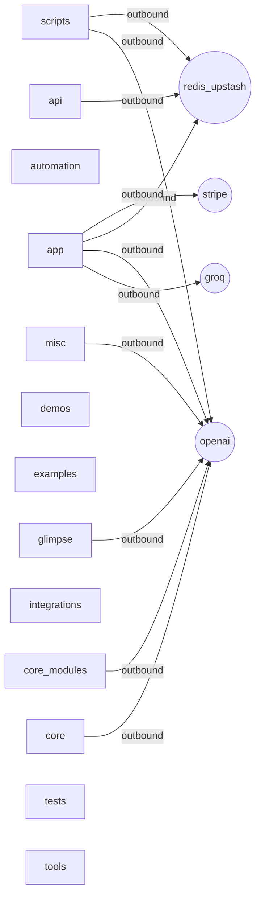

## Candidates

### `api` — `inventory-only`

- **Markers:** python-script
- **Layout:** src=False · tests=False · scripts=False · data=False · docs=False
- **Tests:** none
- **Inbound (6):**
  - `http` `/api/patterns/detect`
  - `http` `/api/search`
  - `http` `/api/truth/verify`
  - `http` `/health`
  - `http` `/health/resilience`
  - `http` `/metrics`
- **Outbound:** redis / upstash

**Sylveon heatmap** (`hotspots=6` · 65/35 logic/pattern):

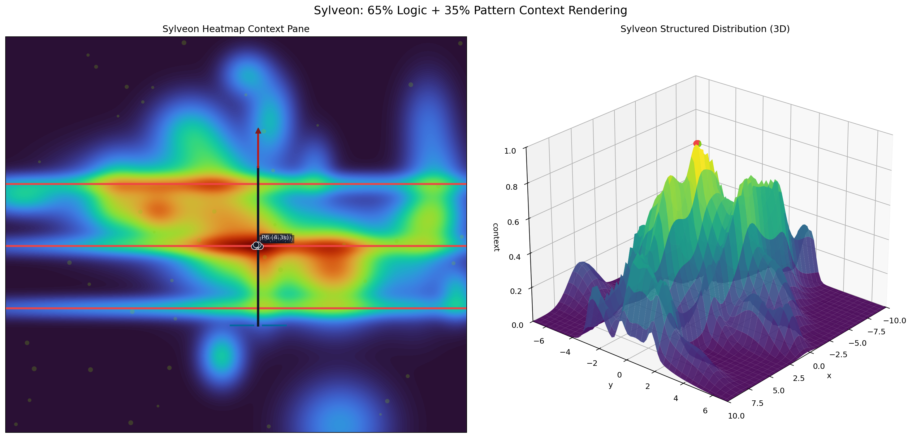

_Animation: `api/sylveon.gif` · heatmap is orientation only — recommendations from `craft.sylveon_heatmap` are heat-geometry templates, not code-specific._

**Fresh test suite design** (current: `none`):

Surface to cover:
- **HTTP**: 6 routes
- **Top-level scripts**: __init__.py, config.py, dependencies.py, logging_structured.py, main.py
- **Outbound integrations**: redis / upstash

Suggested layers:
  1. **Route handlers** — happy path + 4xx/5xx per route, auth/signature checks
  2. **External boundary** — mock outbound calls, verify retry/timeout/idempotence posture
  3. **Output / side-effects** — files written, naming convention, re-run idempotence

**Suggested framework**: pytest — single dep, runs via `uv run --with pytest python -m pytest`. Preserves stdlib-only ethos at the source layer; tests bring in pytest only.
**Initial layout**: `tests/{test_routes.py, test_output.py}`

### `app` — `inventory-only`

- **Markers:** python-script
- **Layout:** src=False · tests=False · scripts=False · data=False · docs=False
- **Tests:** none
- **Inbound (1):**
  - `http` `/auth/login`
- **Outbound:** groq, openai, redis / upstash, stripe

**Sylveon heatmap** (`hotspots=1` · 65/35 logic/pattern):

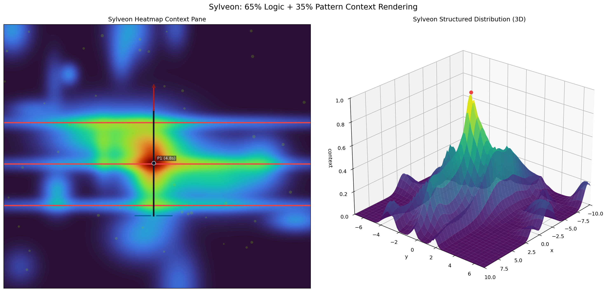

_Animation: `app/sylveon.gif` · heatmap is orientation only — recommendations from `craft.sylveon_heatmap` are heat-geometry templates, not code-specific._

**Fresh test suite design** (current: `none`):

Surface to cover:
- **HTTP**: 1 routes
- **Top-level scripts**: __init__.py, model_router.py, values.py
- **Outbound integrations**: groq, openai, redis / upstash, stripe

Suggested layers:
  1. **Route handlers** — happy path + 4xx/5xx per route, auth/signature checks
  2. **External boundary** — mock outbound calls, verify retry/timeout/idempotence posture
  3. **Output / side-effects** — files written, naming convention, re-run idempotence

**Suggested framework**: pytest — single dep, runs via `uv run --with pytest python -m pytest`. Preserves stdlib-only ethos at the source layer; tests bring in pytest only.
**Initial layout**: `tests/{test_routes.py, test_output.py}`

### `automation` — `inventory-only`

- **Markers:** python-script
- **Layout:** src=False · tests=False · scripts=False · data=False · docs=False
- **Tests:** none

**Sylveon heatmap** (`hotspots=4` · 65/35 logic/pattern):

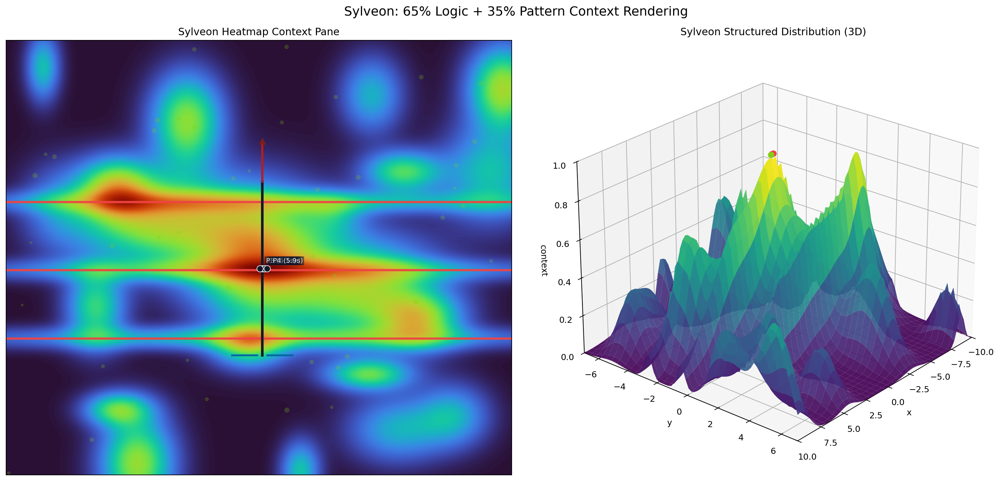

_Animation: `automation/sylveon.gif` · heatmap is orientation only — recommendations from `craft.sylveon_heatmap` are heat-geometry templates, not code-specific._

**Fresh test suite design** (current: `none`):

Surface to cover:
- **Top-level scripts**: __init__.py

Suggested layers:
  1. **Output / side-effects** — files written, naming convention, re-run idempotence

**Suggested framework**: pytest — single dep, runs via `uv run --with pytest python -m pytest`. Preserves stdlib-only ethos at the source layer; tests bring in pytest only.
**Initial layout**: `tests/{test_output.py}`

### `core` — `inventory-only`

- **Markers:** python-script
- **Layout:** src=False · tests=False · scripts=False · data=False · docs=False
- **Tests:** none
- **Outbound:** openai

**Sylveon heatmap** (`hotspots=4` · 65/35 logic/pattern):

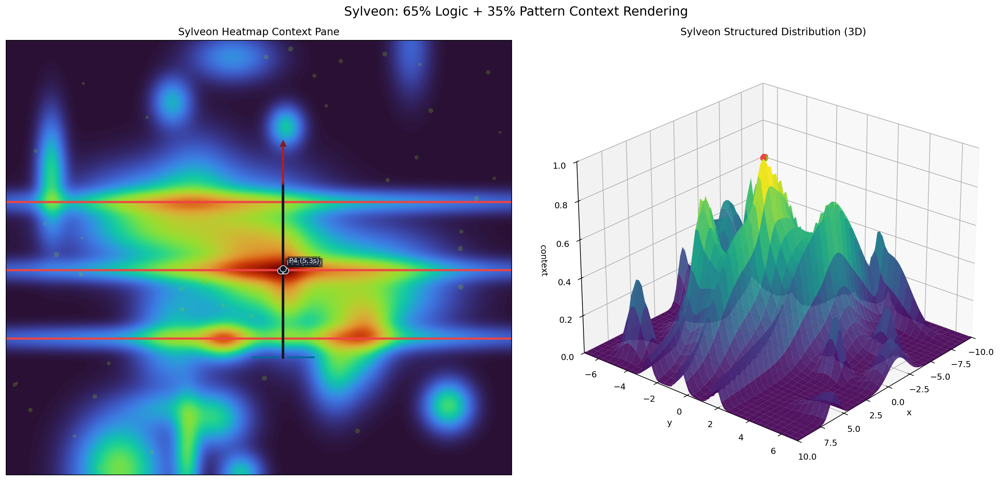

_Animation: `core/sylveon.gif` · heatmap is orientation only — recommendations from `craft.sylveon_heatmap` are heat-geometry templates, not code-specific._

**Fresh test suite design** (current: `none`):

Surface to cover:
- **Top-level scripts**: __init__.py, display_utils.py, ethos.py, exporter.py
- **Outbound integrations**: openai

Suggested layers:
  1. **External boundary** — mock outbound calls, verify retry/timeout/idempotence posture
  2. **Output / side-effects** — files written, naming convention, re-run idempotence

**Suggested framework**: pytest — single dep, runs via `uv run --with pytest python -m pytest`. Preserves stdlib-only ethos at the source layer; tests bring in pytest only.
**Initial layout**: `tests/{test_output.py}`

### `core_modules` — `inventory-only`

- **Markers:** python-script
- **Layout:** src=False · tests=False · scripts=False · data=False · docs=False
- **Tests:** none
- **Outbound:** openai

**Sylveon heatmap** (`hotspots=4` · 65/35 logic/pattern):

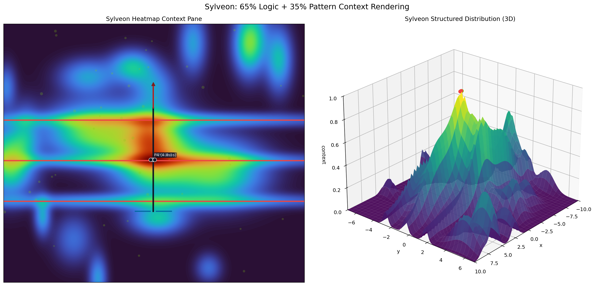

_Animation: `core_modules/sylveon.gif` · heatmap is orientation only — recommendations from `craft.sylveon_heatmap` are heat-geometry templates, not code-specific._

**Fresh test suite design** (current: `none`):

Surface to cover:
- **Top-level scripts**: __init__.py, caching.py, catch_release_system.py, context_manager.py, cross_reference_system.py
- **Outbound integrations**: openai

Suggested layers:
  1. **External boundary** — mock outbound calls, verify retry/timeout/idempotence posture
  2. **Output / side-effects** — files written, naming convention, re-run idempotence

**Suggested framework**: pytest — single dep, runs via `uv run --with pytest python -m pytest`. Preserves stdlib-only ethos at the source layer; tests bring in pytest only.
**Initial layout**: `tests/{test_output.py}`

### `demos` — `inventory-only`

- **Markers:** python-script
- **Layout:** src=False · tests=False · scripts=False · data=False · docs=False
- **Tests:** none

**Sylveon heatmap** (`hotspots=4` · 65/35 logic/pattern):

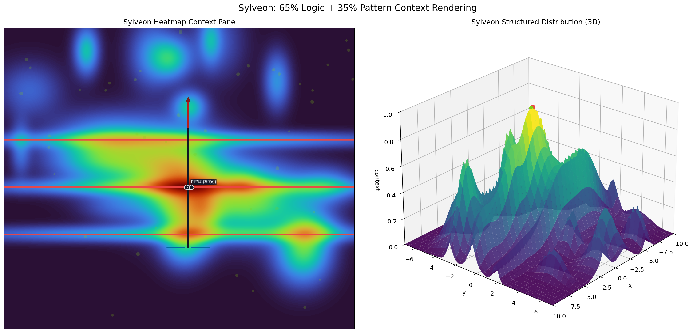

_Animation: `demos/sylveon.gif` · heatmap is orientation only — recommendations from `craft.sylveon_heatmap` are heat-geometry templates, not code-specific._

**Fresh test suite design** (current: `none`):

Surface to cover:
- **Top-level scripts**: __init__.py, demo_business_scenario.py, demo_glimpse_initialization.py, demo_investment_advisor.py, demo_space_research.py

Suggested layers:
  1. **Output / side-effects** — files written, naming convention, re-run idempotence

**Suggested framework**: pytest — single dep, runs via `uv run --with pytest python -m pytest`. Preserves stdlib-only ethos at the source layer; tests bring in pytest only.
**Initial layout**: `tests/{test_output.py}`

### `examples` — `inventory-only`

- **Markers:** python-script
- **Layout:** src=False · tests=False · scripts=False · data=False · docs=False
- **Tests:** none
- **Inbound (1):**
  - `cli` `--quick`

**Sylveon heatmap** (`hotspots=1` · 65/35 logic/pattern):

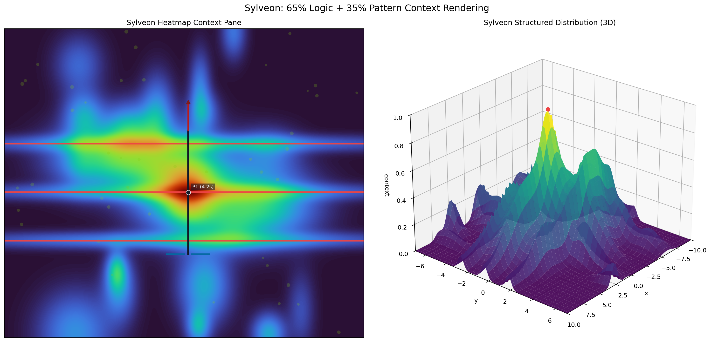

_Animation: `examples/sylveon.gif` · heatmap is orientation only — recommendations from `craft.sylveon_heatmap` are heat-geometry templates, not code-specific._

**Fresh test suite design** (current: `none`):

Surface to cover:
- **CLI**: 1 flags — `--quick`
- **Top-level scripts**: agentic_capabilities_demo.py, filesystem_capabilities_demo.py, filesystem_function_calling_demo.py, rag_integration_example.py, run_context_aware_call.py

Suggested layers:
  1. **Argument parsing** — each flag standalone, missing required, invalid types/values
  2. **Output / side-effects** — files written, naming convention, re-run idempotence

**Suggested framework**: pytest — single dep, runs via `uv run --with pytest python -m pytest`. Preserves stdlib-only ethos at the source layer; tests bring in pytest only.
**Initial layout**: `tests/{test_args.py, test_output.py}`

### `glimpse` — `inventory-only`

- **Markers:** python-script
- **Layout:** src=False · tests=False · scripts=False · data=False · docs=False
- **Tests:** none
- **Inbound (2):**
  - `cli` `-r -u`
  - `http` `/v1/chat/completions`
- **Outbound:** openai

**Sylveon heatmap** (`hotspots=2` · 65/35 logic/pattern):

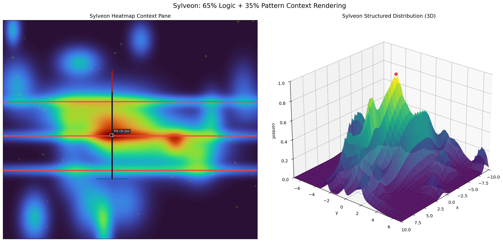

_Animation: `glimpse/sylveon.gif` · heatmap is orientation only — recommendations from `craft.sylveon_heatmap` are heat-geometry templates, not code-specific._

**Fresh test suite design** (current: `none`):

Surface to cover:
- **CLI**: 2 flags — `-r -u`
- **HTTP**: 1 routes
- **Top-level scripts**: Glimpse.py, __init__.py, alignment.py, batch_helpers.py, benchmark_cached_batch.py
- **Outbound integrations**: openai

Suggested layers:
  1. **Argument parsing** — each flag standalone, missing required, invalid types/values
  2. **Route handlers** — happy path + 4xx/5xx per route, auth/signature checks
  3. **External boundary** — mock outbound calls, verify retry/timeout/idempotence posture
  4. **Output / side-effects** — files written, naming convention, re-run idempotence

**Suggested framework**: pytest — single dep, runs via `uv run --with pytest python -m pytest`. Preserves stdlib-only ethos at the source layer; tests bring in pytest only.
**Initial layout**: `tests/{test_args.py, test_routes.py, test_output.py}`

### `integrations` — `inventory-only`

- **Markers:** python-script
- **Layout:** src=False · tests=False · scripts=False · data=False · docs=False
- **Tests:** none

**Sylveon heatmap** (`hotspots=4` · 65/35 logic/pattern):

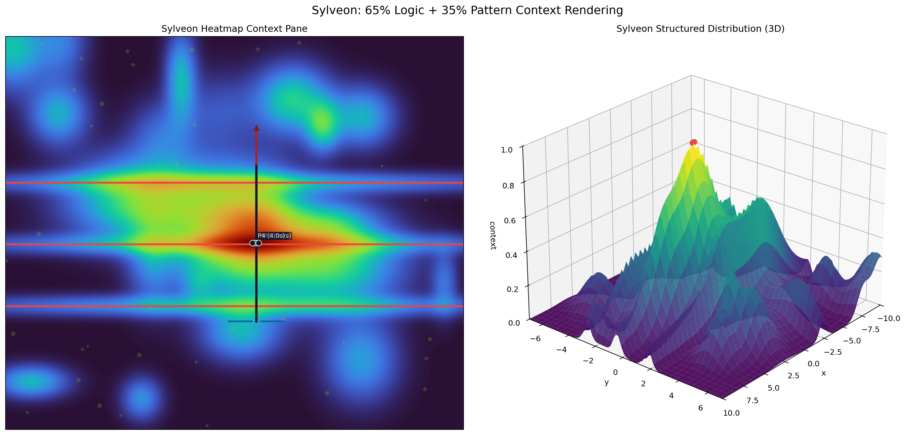

_Animation: `integrations/sylveon.gif` · heatmap is orientation only — recommendations from `craft.sylveon_heatmap` are heat-geometry templates, not code-specific._

**Fresh test suite design** (current: `none`):

Surface to cover:
- **Top-level scripts**: __init__.py, impact_analytics_connector.py, turbo_bridge.py

Suggested layers:
  1. **Output / side-effects** — files written, naming convention, re-run idempotence

**Suggested framework**: pytest — single dep, runs via `uv run --with pytest python -m pytest`. Preserves stdlib-only ethos at the source layer; tests bring in pytest only.
**Initial layout**: `tests/{test_output.py}`

### `misc` — `inventory-only`

- **Markers:** src
- **Layout:** src=True · tests=False · scripts=False · data=True · docs=False
- **Src packages:** utils
- **Tests:** none
- **Inbound (29):**
  - `http` `/`
  - `http` `/api/patterns/detect`
  - `http` `/api/search`
  - `http` `/api/truth/verify`
  - `http` `/api/v1/analytics`
  - `http` `/api/v1/analyze/image`
  - `http` `/api/v1/analyze/image/upload`
  - `http` `/api/v1/process/media`
  - `http` `/api/v1/transcribe/audio`
  - `http` `/api/v1/transcribe/audio/upload`
  - `http` `/api/v1/webhooks/list`
  - `http` `/api/v1/webhooks/register`
  - `http` `/api/v1/webhooks/{webhook_id}`
  - `http` `/audit`
  - `http` `/experiment/run`
  - `http` `/extract/invoice`
  - `http` `/generate/dataset`
  - `http` `/health`
  - `http` `/models/available`
  - `http` `/v1/analytics`
  - … and 9 more
- **Outbound:** openai

**Sylveon heatmap** (`hotspots=8` · 65/35 logic/pattern):

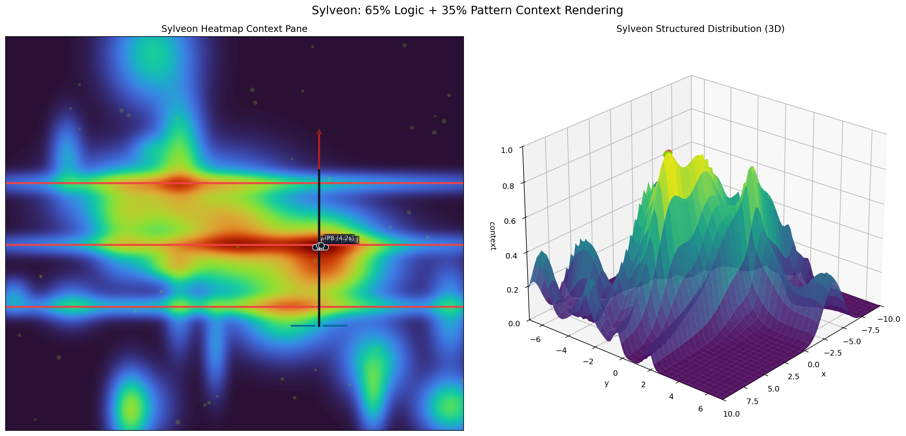

_Animation: `misc/sylveon.gif` · heatmap is orientation only — recommendations from `craft.sylveon_heatmap` are heat-geometry templates, not code-specific._

**Fresh test suite design** (current: `none`):

Surface to cover:
- **HTTP**: 29 routes
- **Outbound integrations**: openai

Suggested layers:
  1. **Route handlers** — happy path + 4xx/5xx per route, auth/signature checks
  2. **External boundary** — mock outbound calls, verify retry/timeout/idempotence posture
  3. **Output / side-effects** — files written, naming convention, re-run idempotence

**Suggested framework**: pytest — single dep, runs via `uv run --with pytest python -m pytest`. Preserves stdlib-only ethos at the source layer; tests bring in pytest only.
**Initial layout**: `tests/{test_routes.py, test_output.py}`

### `scripts` — `inventory-only`

- **Markers:** python-script
- **Layout:** src=False · tests=False · scripts=False · data=False · docs=False
- **Tests:** none
- **Inbound (9):**
  - `cli` `--debug`
  - `cli` `--mood --preset --user-id`
  - `cli` `--output`
  - `cli` `--queries --quiet`
  - `cli` `--root-dir`
  - `cli` `--verbose`
  - `http` `/v1/chat/completions`
  - `http` `/v1/embeddings`
  - `http` `/v1/responses`
- **Outbound:** openai, redis / upstash

**Sylveon heatmap** (`hotspots=8` · 65/35 logic/pattern):

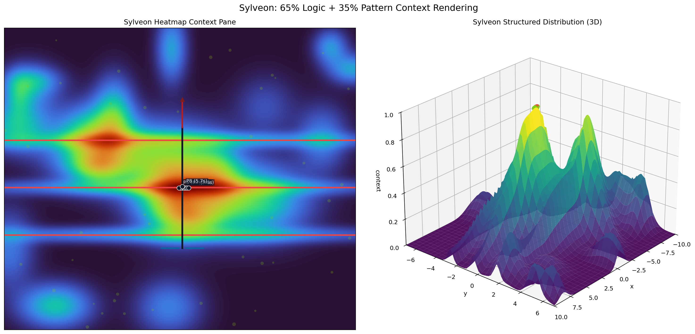

_Animation: `scripts/sylveon.gif` · heatmap is orientation only — recommendations from `craft.sylveon_heatmap` are heat-geometry templates, not code-specific._

**Fresh test suite design** (current: `none`):

Surface to cover:
- **CLI**: 1 flags — `--output`
- **HTTP**: 3 routes
- **Top-level scripts**: advanced_echoes_assistant.py, allocation.py, alpha_falcon_engine.py, api_call.py, assistant.py
- **Outbound integrations**: openai, redis / upstash

Suggested layers:
  1. **Argument parsing** — each flag standalone, missing required, invalid types/values
  2. **Route handlers** — happy path + 4xx/5xx per route, auth/signature checks
  3. **External boundary** — mock outbound calls, verify retry/timeout/idempotence posture
  4. **Output / side-effects** — files written, naming convention, re-run idempotence

**Suggested framework**: pytest — single dep, runs via `uv run --with pytest python -m pytest`. Preserves stdlib-only ethos at the source layer; tests bring in pytest only.
**Initial layout**: `tests/{test_args.py, test_routes.py, test_output.py}`

### `tests` — `inventory-only`

- **Markers:** python-script
- **Layout:** src=False · tests=False · scripts=False · data=False · docs=False
- **Tests:** none

**Sylveon heatmap** (`hotspots=4` · 65/35 logic/pattern):

_Animation: `tests/sylveon.gif` · heatmap is orientation only — recommendations from `craft.sylveon_heatmap` are heat-geometry templates, not code-specific._

**Fresh test suite design** (current: `none`):

Surface to cover:
- **Top-level scripts**: __init__.py, benchmark_rate_limiter.py, conftest.py, test_agentic_assistant.py, test_all_demos.py

Suggested layers:
  1. **Output / side-effects** — files written, naming convention, re-run idempotence

**Suggested framework**: pytest — single dep, runs via `uv run --with pytest python -m pytest`. Preserves stdlib-only ethos at the source layer; tests bring in pytest only.
**Initial layout**: `tests/{test_output.py}`

### `tools` — `inventory-only`

- **Markers:** python-script
- **Layout:** src=False · tests=False · scripts=False · data=False · docs=False
- **Tests:** none

**Sylveon heatmap** (`hotspots=4` · 65/35 logic/pattern):

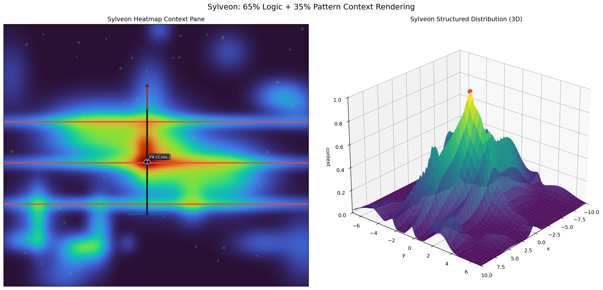

_Animation: `tools/sylveon.gif` · heatmap is orientation only — recommendations from `craft.sylveon_heatmap` are heat-geometry templates, not code-specific._

**Fresh test suite design** (current: `none`):

Surface to cover:
- **Top-level scripts**: __init__.py, examples.py, glimpse_tools.py, path_setup.py, registry.py

Suggested layers:
  1. **Output / side-effects** — files written, naming convention, re-run idempotence

**Suggested framework**: pytest — single dep, runs via `uv run --with pytest python -m pytest`. Preserves stdlib-only ethos at the source layer; tests bring in pytest only.
**Initial layout**: `tests/{test_output.py}`

## Test artifacts touched (Phase 3)

_Phase 3 was skipped (`--run-tests` not set)._

