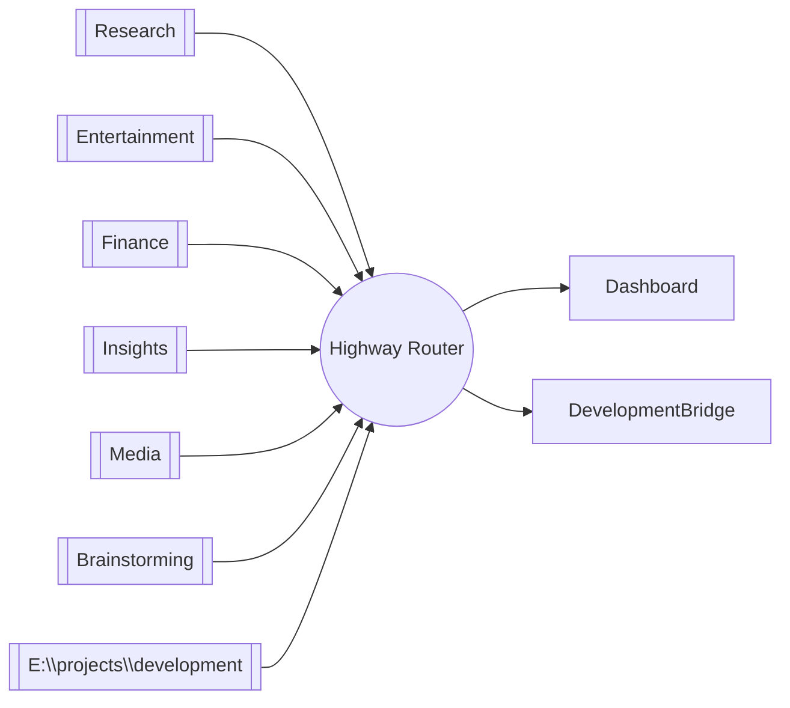
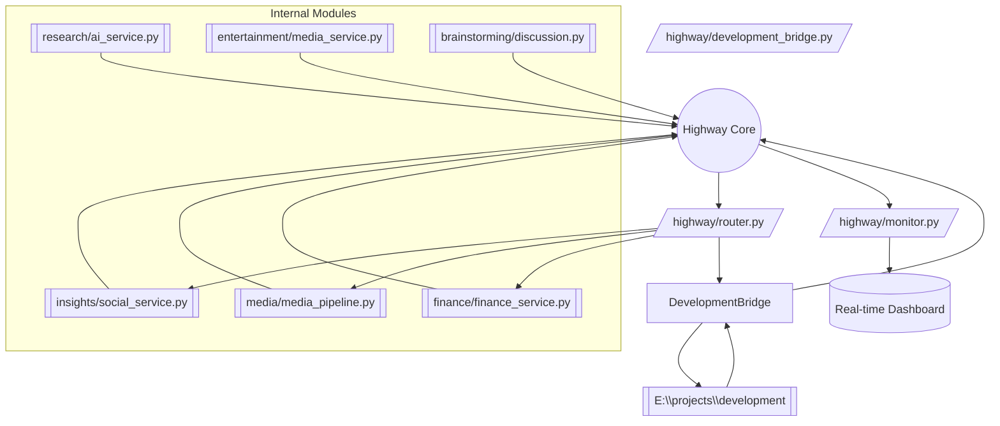

# 🛣️ Highway System Overview

Your Highway intelligent routing system connects every sector of the Unified Hub and the external development workspace. This document provides quick visual references to understand the flow.

## 1. Simplified View



## 2. Detailed Highway Flow



## 3. System Components

- **Highway Core**: Handles packet routing and adaptive learning (`highway/__init__.py`).
- **Highway Router**: Smart cross-module communication (`highway/router.py`).
- **Development Bridge**: Syncs with `E:\\projects\\development` (`highway/development_bridge.py`).
- **Monitor**: Real-time performance tracking and optimization (`highway/monitor.py`).
- **Quick Start**: Command examples to exercise the system (`highway/quick_start.py`).

## 4. Quick Usage Reminder

```bash
cd D:\hub\hub
set PYTHONPATH=D:\hub\hub;%PYTHONPATH%

# Start monitoring
y python highway\monitor.py

# Run quick start
python highway\quick_start.py

# Route sample data
python -c "from highway.router import get_highway_router; router = get_highway_router(); router.route_finance_to_content({'sample': 'data'})"
```

Use this document as the visual starting point before diving into the full testing and automation plan.
