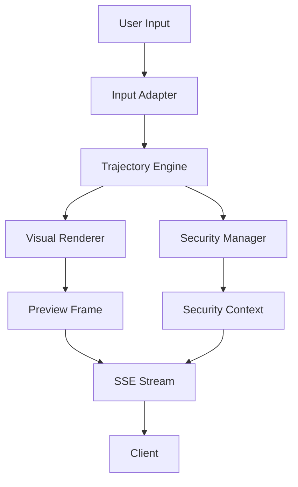

# Project Findings and Solutions
*Generated: October 18, 2025*

## Executive Summary

This document summarizes the findings from our recent development work on the Echoes platform and provides actionable solutions for identified issues. We have successfully implemented two major features (Context-Aware AI Agent and Documentation-Driven Security) while uncovering several infrastructure issues that need attention.

## Critical Issues and Solutions

### 1. Dependency Vulnerabilities ⚠️

**Issue:** Dependabot has identified 7 security vulnerabilities across multiple dependency files:
- 4 High priority vulnerabilities in `python-multipart`, `starlette`, `ecdsa`
- 1 Moderate vulnerability in `black`
- 1 Low vulnerability in `tqdm`

**Root Cause:** Outdated dependencies and inconsistent dependency management across the project.

**Solution:**
```bash
# Immediate action via GitHub:
1. Navigate to https://github.com/caraxesthebloodwyrm02/echoes/security/dependabot
2. Review and merge Dependabot's automated pull requests
3. Pull changes locally: git pull origin main

# Long-term solution:
# Consolidate dependency management (see Section 3)
```

### 2. Broken Poetry Environment 🔧

**Issue:** Poetry cannot find Python executable in `backend/` directory, preventing dependency management.

**Root Cause:** Poetry is looking for Python at a hardcoded path that no longer exists.

**Solution:**
```bash
# Fix Poetry environment
cd backend/

# Option 1: Use the virtual environment Python
poetry env use ../venv/Scripts/python.exe

# Option 2: Use system Python
poetry env use $(which python)

# Option 3: Complete reset
poetry env remove python
poetry install
```

### 3. Inconsistent Dependency Management 📦

**Issue:** Project uses both Poetry (`backend/`) and pip (`requirements.txt`) causing confusion.

**Solution - Unified Dependency Strategy:**
```python
# Create a unified dependency management script
# Save as: scripts/manage_deps.py

import subprocess
import sys
from pathlib import Path

def update_all_dependencies():
    """Update all project dependencies in a unified manner"""
    
    # Update root requirements
    print("Updating root dependencies...")
    subprocess.run([sys.executable, "-m", "pip", "install", "-r", "requirements.txt", "--upgrade"])
    
    # Update backend Poetry dependencies
    print("Updating backend dependencies...")
    backend_path = Path("backend")
    if backend_path.exists():
        subprocess.run(["poetry", "update"], cwd=backend_path)
    
    # Generate updated lock files
    print("Generating lock files...")
    subprocess.run([sys.executable, "-m", "pip", "freeze", ">", "requirements-lock.txt"], shell=True)

if __name__ == "__main__":
    update_all_dependencies()
```

## Important Observations and Fixes

### 4. Missing Pre-commit Configuration ✅

**Issue:** Pre-commit hooks are installed but `.pre-commit-config.yaml` is missing.

**Solution - Create Configuration:**
```yaml
# Save as: .pre-commit-config.yaml
repos:
  - repo: https://github.com/psf/black
    rev: 24.8.0
    hooks:
      - id: black
        language_version: python3.12

  - repo: https://github.com/charliermarsh/ruff-pre-commit
    rev: v0.5.0
    hooks:
      - id: ruff
        args: [--fix]

  - repo: https://github.com/pre-commit/pre-commit-hooks
    rev: v4.5.0
    hooks:
      - id: trailing-whitespace
      - id: end-of-file-fixer
      - id: check-yaml
      - id: check-added-large-files
      - id: check-json
      - id: check-merge-conflict

  - repo: https://github.com/pre-commit/mirrors-mypy
    rev: v1.8.0
    hooks:
      - id: mypy
        additional_dependencies: [types-requests]
```

### 5. Implicit Dependencies 📝

**Issue:** Several packages are used but not documented in requirements files.

**Solution - Complete Dependencies List:**
```txt
# Additional dependencies to add to requirements.txt:
pre-commit>=4.3.0
pip-audit>=2.9.0
pipdeptree>=2.29.0

# For development:
mypy>=1.8.0
types-requests>=2.32.0
```

## Major Accomplishments 🎉

### Context-Aware AI Agent

We successfully implemented a sophisticated AI agent that can:
- Search for files in the codebase using fuzzy matching
- Read file contents with security boundaries
- Chain multiple tool calls to answer complex queries
- Maintain context across multi-step reasoning

**Key Files:**
- `core/context_aware_api.py` - Main implementation
- `examples/run_context_aware_call.py` - Demonstration script

### Documentation-Driven Security

We created an innovative security system that:
- Parses security protocols from Markdown documentation
- Enforces these protocols at runtime via middleware
- Includes rate limiting and authentication checks
- Validates input according to documented specifications

**Key Files:**
- `automation/guardrails/middleware.py` - Middleware implementation
- `automation/guardrails/ingest_docs.py` - Documentation parser
- `tests/test_guardrails_integration.py` - Integration tests

## High-Level Design Documentation

### Glimpse System Architecture

The Glimpse system is the core real-time preview and trajectory tracking engine. Here's its conceptual design:



**Core Concepts:**
- **Trajectory:** A time-series representation of user actions and system states
- **Preview Frame:** A visual snapshot of the current system state
- **Security Context:** Runtime security assessment based on current operations

## Implementation Roadmap

### Phase 1: Immediate Fixes (Week 1)
- [ ] Merge Dependabot PRs on GitHub
- [ ] Fix Poetry environment in backend/
- [ ] Add missing dependencies to requirements.txt
- [ ] Create and configure .pre-commit-config.yaml

### Phase 2: Consolidation (Week 2)
- [ ] Unify dependency management strategy
- [ ] Create automated dependency update script
- [ ] Document all environment setup procedures
- [ ] Add CI/CD pipeline for security scanning

### Phase 3: Enhancement (Week 3-4)
- [ ] Expand context-aware AI capabilities
- [ ] Add more security protocol parsers
- [ ] Create comprehensive API documentation
- [ ] Implement automated testing for all new features

## Testing and Validation

### Security Testing
```bash
# Run security audit
pip-audit -r requirements.txt

# Check for code vulnerabilities
bandit -r . -f json -o security_report.json

# Run integration tests
pytest tests/test_guardrails_integration.py -v
```

### Performance Testing
```python
# Test context-aware API performance
import time
from core.context_aware_api import ContextAwareAPICall
from core.realtime_preview import create_glimpse

glimpse = create_glimpse(enable_security=False, enable_guardrails=True)
glimpse.start()

api = ContextAwareAPICall(glimpse)
start = time.time()
result = api.run("What is the purpose of GuardrailMiddleware?")
print(f"Response time: {time.time() - start:.2f}s")
```

## Conclusion

The Echoes platform has been significantly enhanced with:
1. **Context-Aware AI** - Multi-step reasoning about codebase
2. **Documentation-Driven Security** - Self-enforcing security protocols
3. **Improved Architecture** - Better package structure and testing

However, several infrastructure issues need immediate attention:
1. **Security vulnerabilities** in dependencies (use Dependabot)
2. **Broken Poetry environment** (needs reconfiguration)
3. **Missing pre-commit hooks** (configuration provided above)

Following the implementation roadmap will resolve these issues and establish a more maintainable development environment.

---
*This document should be updated as issues are resolved and new findings emerge.*
