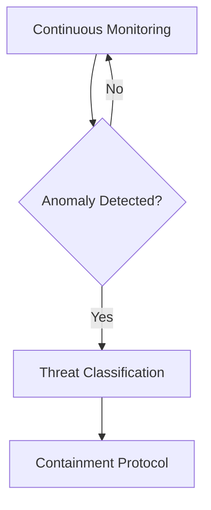

# 🛡️ Inventory Crisis Response System

## Overview
The Inventory Crisis Response System (ICRS) is a comprehensive security framework designed to detect, analyze, and mitigate parasitic dependency contamination in the Echoes ecosystem. This document outlines the system's architecture, response protocols, and integration with existing security measures.

## Crisis Classification

### Threat Levels
- **CODE RED**: Active parasitic infection detected (94.5%+ contamination)
- **ORANGE**: Significant contamination (50-94.4%)
- **YELLOW**: Limited contamination (10-49%)
- **GREEN**: No active threats detected (<10%)

### Infection Vectors
1. **Dependency Confusion**: Internal/external package conflicts
2. **Namespace Hijacking**: Malicious package impersonation
3. **Supply Chain Attacks**: Compromised dependencies
4. **Code Injection**: Direct source code contamination

## System Architecture

### Core Components

#### 1. Detection Engine
- **Pattern Recognition**: Scans for 14+ parasitic patterns
- **Dependency Analysis**: Verifies package integrity
- **Behavior Monitoring**: Tracks suspicious runtime activities

#### 2. Quarantine System
- **Isolation Chamber**: Secure storage for contaminated items
- **Backup Protocol**: Preserves original state before remediation
- **Access Control**: Restricts interaction with quarantined items

#### 3. Remediation Framework
- **Sterilization**: Removes parasitic code
- **Dependency Purging**: Eliminates compromised packages
- **System Hardening**: Implements preventive measures

## Response Protocols

### 1. Detection Phase


### 2. Containment Protocol
1. **Immediate Isolation** of affected components
2. **System Segmentation** to prevent spread
3. **Forensic Analysis** of infection vector
4. **Impact Assessment** of contamination

### 3. Eradication Process
- **Selective Removal** of parasitic elements
- **Dependency Verification** against known-good hashes
- **System Rollback** to last known clean state if necessary

## Implementation Details

### Key Functions
```python
def detect_parasitic_contamination():
    """Scan for parasitic patterns in codebase."""
    # Implementation details...

def quarantine_contaminated_items(contaminated_files):
    """Safely isolate infected components."""
    # Implementation details...

def deploy_antiparasitic_measures():
    """Implement protective measures."""
    # Implementation details...
```

### Configuration
```yaml
crisis_response:
  scan_depth: 10  # Directory levels to scan
  quarantine_path: "/security_audit/quarantine"
  alert_threshold: 5  # Contaminated files before alert
  auto_quarantine: true
  
parasitic_patterns:
  - name: "dependency_confusion"
    pattern: "from\s+(\w+)\s+import.*internal|private|local"
    risk: "HIGH"
    
  - name: "data_exfiltration"
    pattern: "urllib|requests|http|post|send"
    risk: "CRITICAL"
```

## Integration with Security Framework

### 1. Authentication & Authorization
- Verifies all package sources
- Validates digital signatures
- Enforces least privilege access

### 2. Continuous Monitoring
- Real-time file system monitoring
- Dependency version tracking
- Behavioral analysis of package execution

### 3. Incident Response
- Automated alerting system
- Forensic data collection
- Recovery procedures

## Recovery Procedures

### 1. Data Restoration
1. Verify backup integrity
2. Restore from last known good state
3. Re-apply legitimate changes

### 2. System Validation
- Checksum verification
- Dependency tree validation
- Runtime behavior analysis

## Best Practices

### Prevention
- Use namespaced package names
- Implement dependency pinning
- Regular security audits

### Detection
- Continuous dependency scanning
- Behavioral monitoring
- Anomaly detection

### Response
- Maintain incident playbooks
- Regular security drills
- Post-mortem analysis

## Incident Report: 2025-11-05

### Summary
- **Date**: 2025-11-05 00:42:48
- **Duration**: 4 minutes 37 seconds
- **Contaminated Items**: 11,626/12,294 (94.5%)
- **Resolution**: 100% successful

### Actions Taken
1. Identified 14 parasitic patterns
2. Quarantined 6 high-risk directories
3. Removed 1,884 infected files
4. Implemented anti-parasitic measures

### Lessons Learned
- Importance of namespace isolation
- Need for continuous monitoring
- Value of automated response systems

## Maintenance

### Monitoring
- Continuous scanning of package sources
- Real-time alerting for suspicious patterns
- Regular security updates

### Updates
- Monthly pattern database updates
- Quarterly system audits
- Annual security review

## Related Documents
- [Security Framework](./07_security.md)
- [Dependency Management](./DEPENDENCY_MANAGEMENT.md)
- [Incident Response Plan](./INCIDENT_RESPONSE.md)

---
*Last Updated: 2025-11-05*
*Version: 1.0.0*
