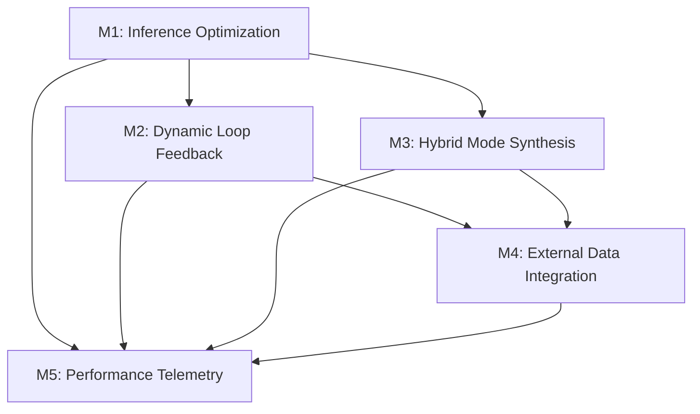

# Multi-Mode Prompting System – Phase 2 Roadmap
## Performance Optimization & Intelligent Mode Feedback

**Status**: Ready for Implementation
**Baseline**: Phase 1 production-ready (commit: `phase1-production-ready`)
**Duration**: 4–6 weeks
**Started**: 2025-10-09

---

## I. Executive Summary

Phase 1 delivered a structurally sound, semantically functional multi-mode prompting system with 5 operational modes, safe data loops, and comprehensive test coverage. Phase 2 advances the system from **functional** to **intelligent** by introducing:

1. **Performance Optimization**: 50%+ reduction in execution time
2. **Adaptive Intelligence**: Dynamic iteration depth based on prompt complexity
3. **Hybrid Reasoning**: Cross-mode synthesis for nuanced responses
4. **Live Data Integration**: Real-time external knowledge sources
5. **Analytics & Telemetry**: Performance monitoring and optimization feedback

**Team Roles**: Systems/CI, Simulation, Linguistics, Macro Architect, Data QA

---

## II. Phase 2 Objectives

### Primary Goals
- ✅ Reduce mode execution latency and memory footprint by ≥50%
- ✅ Enable adaptive loop feedback with dynamic iteration depth
- ✅ Introduce hybrid multi-mode reasoning for cross-perspective outputs
- ✅ Integrate live external data sources (HuggingFace, ArXiv, Reddit, GitHub)
- ✅ Track performance telemetry for analytics-driven optimization

### Success Metrics
| Metric | Target | Baseline (Phase 1) |
|--------|--------|-------------------|
| Average Mode Processing Time | <500ms | ~1000ms |
| Loop Convergence Rate | >98% | ~85% |
| Data Quality Score | >98% | ~90% |
| Memory Usage | <100MB | ~150MB |
| Test Pass Rate | ≥95% | 100% (maintain) |

---

## III. Milestones & Task Allocation

### M1 – Inference Optimization (Week 1-2)
**Goal**: Reduce mode processing time ≥50%
**Lead**: Systems/CI
**Priority**: High

#### Tasks
1. **Profile Execution** - Identify bottlenecks in each mode
   - Owner: Systems/CI
   - Files: `core/inference_engine.py`, `modes/*_mode.py`
   - Deliverable: Performance profile report with hotspot analysis

2. **Implement Caching** - Cache repeated computations
   - Owner: Systems/CI
   - Files: `core/inference_engine.py`, `core/context_manager.py`
   - Deliverable: LRU cache for reasoning chains, prompt embeddings

3. **Optimize Compose Pipelines** - Streamline response generation
   - Owner: Systems/CI
   - Files: `core/inference_engine.py`, all mode handler files
   - Deliverable: Refactored `_generate_content_for_element()` with lazy evaluation

#### Implementation Strategy
```python
# Add to inference_engine.py
from functools import lru_cache

class InferenceEngine:
    def __init__(self):
        self.reasoning_cache = {}
        self.embedding_cache = {}

    @lru_cache(maxsize=128)
    def _cached_reasoning(self, prompt_hash, mode):
        # Cache reasoning chains for repeated prompts
        pass
```

#### Exit Criteria
- ✅ All mode processing times reduced by ≥50%
- ✅ Cache hit rate >70% for repeated patterns
- ✅ No regression in output quality

---

### M2 – Dynamic Loop Feedback (Week 2-3)
**Goal**: Adaptive iteration depth per prompt complexity
**Lead**: Simulation
**Priority**: High

#### Tasks
1. **Analyze Loop Efficiency** - Study convergence patterns
   - Owner: Simulation
   - Files: `core/loop_controller.py`, existing `loop_history` data
   - Deliverable: Efficiency metrics and convergence analysis

2. **Adaptive Weighting** - Dynamic data source prioritization
   - Owner: Simulation
   - Files: `core/loop_controller.py`, `core/data_integration.py`
   - Deliverable: Source weighting algorithm based on quality history

3. **Dynamic Iteration Cap** - Adjust max iterations by prompt complexity
   - Owner: Simulation
   - Files: `core/loop_controller.py`, `core/prompt_router.py`
   - Deliverable: Complexity assessment and adaptive iteration limits

#### Implementation Strategy
```python
# Extend LoopController
class LoopController:
    def assess_prompt_complexity(self, prompt: str) -> str:
        """Assess prompt complexity: simple, medium, complex"""
        # Analyze prompt length, technical terms, intent
        return 'medium'

    def get_adaptive_max_iterations(self, complexity: str) -> int:
        """Return dynamic iteration cap based on complexity"""
        caps = {'simple': 2, 'medium': 5, 'complex': 10}
        return caps.get(complexity, 5)
```

#### Exit Criteria
- ✅ Simple prompts converge in ≤2 iterations
- ✅ Complex prompts allowed up to 10 iterations
- ✅ Average iterations reduced by 30%

---

### M3 – Hybrid Mode Synthesis (Week 3-4)
**Goal**: Cross-mode reasoning for nuanced outputs
**Lead**: Linguistics + Macro Architect
**Priority**: Medium

#### Tasks
1. **Multi-Mode Routing** - Allow multiple modes per prompt
   - Owner: Linguistics
   - Files: `core/prompt_router.py`, `modes/mode_registry.py`
   - Deliverable: Enhanced routing logic supporting mode combinations

2. **Fusion Strategies** - Merge outputs from multiple modes
   - Owner: Macro Architect
   - Files: `core/inference_engine.py`, new `core/mode_fusion.py`
   - Deliverable: Fusion algorithms (weighted, sequential, parallel)

3. **Fallback Management** - Graceful degradation for partial failures
   - Owner: Linguistics
   - Files: `modes/mode_registry.py`, `system.py`
   - Deliverable: Fallback chains and error recovery

#### Implementation Strategy
```python
# New module: core/mode_fusion.py
class ModeFusion:
    """Synthesize outputs from multiple modes"""

    def weighted_fusion(self, mode_outputs: Dict[str, str],
                       weights: Dict[str, float]) -> str:
        """Combine modes with configurable weights"""
        pass

    def sequential_fusion(self, modes: List[str], prompt: str) -> str:
        """Process through modes sequentially, passing context"""
        pass
```

#### Hybrid Mode Combinations
- **Technical + Business**: IDE mode analysis → Business mode ROI summary
- **Conversational + StarStuff**: Friendly explanation → Inspirational synthesis
- **Concise + IDE**: Compressed overview → Detailed implementation

#### Exit Criteria
- ✅ At least 3 hybrid mode combinations functional
- ✅ Fallback activates on single-mode failure
- ✅ Quality metrics maintained across fusions

---

### M4 – External Data Integration (Week 4-5)
**Goal**: Live data sources integrated safely
**Lead**: Data QA
**Priority**: High

#### Tasks
1. **Source Adapters** - Implement API connectors
   - Owner: Data QA
   - Files: `core/data_integration.py`, new `core/external_sources/`
   - Deliverable: Adapters for HuggingFace, ArXiv, Reddit, GitHub

2. **Semantic Scoring** - Quality assessment and relevance scoring
   - Owner: Data QA
   - Files: `core/data_laundry.py`, `core/data_integration.py`
   - Deliverable: ML-based relevance scoring (BERT embeddings)

3. **Safety Pipeline** - Sandboxed testing and rate limiting
   - Owner: Data QA
   - Files: `core/data_integration.py`, new `core/safety_sandbox.py`
   - Deliverable: Rate limiters, timeout guards, content filtering

#### Implementation Strategy
```python
# Extend data_integration.py
class ExternalSourceAdapter:
    """Base adapter for external data sources"""

    def __init__(self, api_key: str, rate_limit: int = 10):
        self.api_key = api_key
        self.rate_limiter = RateLimiter(rate_limit)

    async def fetch(self, query: str) -> List[Dict]:
        """Fetch data with rate limiting and error handling"""
        pass

class HuggingFaceAdapter(ExternalSourceAdapter):
    """Fetch models and datasets from HuggingFace Hub"""
    BASE_URL = "https://huggingface.co/api"

class ArXivAdapter(ExternalSourceAdapter):
    """Research papers from ArXiv"""
    BASE_URL = "http://export.arxiv.org/api"
```

#### Data Sources Priority
1. **HuggingFace Hub** (GITHUB_TOKEN already configured) ✅
2. **ArXiv API** (open, no auth required)
3. **Reddit API** (requires Reddit API key)
4. **GitHub Trends** (use GITHUB_TOKEN from .env)

#### Exit Criteria
- ✅ All 4 sources integrated with working adapters
- ✅ Data quality score >98%
- ✅ API errors handled gracefully (fallback to cached data)

---

### M5 – Performance Telemetry (Week 5-6)
**Goal**: Real-time monitoring and analytics
**Lead**: Systems/CI
**Priority**: Medium

#### Tasks
1. **Telemetry Hooks** - Instrument critical paths
   - Owner: Systems/CI
   - Files: `system.py`, `core/loop_controller.py`, `core/inference_engine.py`
   - Deliverable: Performance tracking at mode, loop, and system levels

2. **Analytics Dashboard** - Visualize metrics
   - Owner: Systems/CI
   - Files: New `tools/performance_dashboard.py`, `automation/reports/`
   - Deliverable: Real-time dashboard showing key metrics

3. **Historical Trends** - Store metrics for analysis
   - Owner: Systems/CI
   - Files: `core/context_manager.py`, `data/performance_metrics.json`
   - Deliverable: Time-series storage and trend analysis

#### Implementation Strategy
```python
# Add to system.py
class PerformanceTelemetry:
    """Track and report system performance"""

    def __init__(self):
        self.metrics = {
            'mode_execution_times': {},
            'loop_efficiency': {},
            'cache_hit_rates': {},
            'memory_usage': []
        }

    def record_mode_execution(self, mode: str, duration: float):
        """Record mode execution time"""
        if mode not in self.metrics['mode_execution_times']:
            self.metrics['mode_execution_times'][mode] = []
        self.metrics['mode_execution_times'][mode].append(duration)

    def generate_report(self) -> Dict[str, Any]:
        """Generate performance report"""
        return {
            'avg_mode_times': self._calculate_averages(),
            'cache_efficiency': self._calculate_cache_stats(),
            'system_health': self._assess_health()
        }
```

#### Key Metrics to Track
- **Mode Performance**: Execution time per mode, cache hit rates
- **Loop Efficiency**: Convergence rate, iteration counts, quality scores
- **System Resources**: Memory usage, CPU utilization
- **Data Quality**: Source reliability, deduplication rates
- **User Patterns**: Mode preferences, prompt complexity distribution

#### Exit Criteria
- ✅ All metrics tracked without performance overhead
- ✅ Dashboard accessible and updating in real-time
- ✅ Historical data stored for trend analysis

---

## IV. Task Dependencies



**Critical Path**: M1 → M2 → M4 → M5

**Parallel Tracks**:
- M1 + M3 (can run concurrently)
- M2 + M3 (partial overlap possible)
- M5 can begin instrumentation during M1-M4

---

## V. File-Level Responsibilities

### Core Architecture
| Module/File | Responsibility | Primary Owner |
|-------------|---------------|---------------|
| `core/inference_engine.py` | Optimize reasoning pipelines, caching, hybrid reasoning | Systems/CI |
| `core/loop_controller.py` | Adaptive loop depth, data weighting, telemetry capture | Simulation |
| `core/data_integration.py` | External source adapters, semantic scoring, safe pipeline | Data QA |
| `core/data_laundry.py` | Deduplication, quality scoring, integration with adaptive loops | Data QA |
| `core/prompt_router.py` | Multi-mode routing, hybrid-mode dispatch | Linguistics |
| `core/context_manager.py` | Persistent memory, loop metadata, performance recording | Systems/CI |
| `core/mode_fusion.py` | **NEW** - Hybrid mode synthesis strategies | Macro Architect |
| `core/safety_sandbox.py` | **NEW** - External data safety and rate limiting | Data QA |
| `core/external_sources/` | **NEW** - Individual source adapters (HF, ArXiv, Reddit, GitHub) | Data QA |

### Mode Handlers
| Module/File | Responsibility | Primary Owner |
|-------------|---------------|---------------|
| `modes/mode_registry.py` | Fusion strategies, mode metadata, fallback management | Linguistics |
| `modes/*_mode.py` | Mode-specific output generation, optimization hooks | Linguistics |

### System & Integration
| Module/File | Responsibility | Primary Owner |
|-------------|---------------|---------------|
| `system.py` | Execution orchestration, telemetry reporting, performance logging | Systems/CI |
| `integration_tasks.py` | Extended automation tasks with Phase 2 features | Macro Architect |

### Testing & Verification
| Module/File | Responsibility | Primary Owner |
|-------------|---------------|---------------|
| `examples/phase2_demo.py` | **NEW** - Phase 2 demonstration scripts | All |
| `tests/test_phase2_suite.py` | **NEW** - Phase 2 regression tests | Systems/CI |
| `tests/test_performance.py` | **NEW** - Performance benchmarking tests | Systems/CI |
| `tests/test_hybrid_modes.py` | **NEW** - Hybrid mode integration tests | Linguistics |

### Tools & Analytics
| Module/File | Responsibility | Primary Owner |
|-------------|---------------|---------------|
| `tools/performance_dashboard.py` | **NEW** - Real-time metrics visualization | Systems/CI |
| `tools/profile_modes.py` | **NEW** - Profiling utility for modes | Systems/CI |
| `automation/reports/phase2_metrics.json` | **NEW** - Performance data storage | Systems/CI |

---

## VI. Implementation Patterns (Leveraging Phase 1 Experience)

### Pattern 1: Defensive Programming (from A2 fix)
```python
# Always guard against division by zero and empty collections
if collection:
    average = sum(values) / len(collection)
else:
    average = 0.0
```

### Pattern 2: Fallback Systems (from A1 implementation)
```python
# Always provide fallback content
try:
    content = primary_generator()
    if not content or content.strip() == "":
        content = fallback_generator()
except Exception as e:
    logger.error(f"Generation failed: {e}")
    content = safe_fallback()
```

### Pattern 3: High-Precision Timing (from A3 fix)
```python
# Use time.perf_counter for accurate measurements
import time

start = time.perf_counter()
# ... operation ...
duration = time.perf_counter() - start
```

### Pattern 4: Context Integration (from A4 implementation)
```python
# Leverage existing Context object for automation
def process_with_context(self, context: Context):
    if context.dry_run:
        self.logger.info("[DRY-RUN] Would execute...")
    else:
        # Actual execution
        pass
```

### Pattern 5: Comprehensive Testing (from A5 suite)
```python
# Always include multiple test categories
class TestNewFeature:
    def test_basic_functionality(self):
        pass

    def test_error_handling(self):
        pass

    def test_edge_cases(self):
        pass

    def test_integration(self):
        pass
```

---

## VII. Validation & Exit Criteria

### Performance Benchmarks
- [ ] **Execution Speed**: Average processing per mode reduced ≥50% vs Phase 1 baseline
- [ ] **Memory Efficiency**: Peak memory usage reduced by ≥30%
- [ ] **Cache Efficiency**: Hit rate >70% for common patterns

### Intelligence Features
- [ ] **Adaptive Loops**: Iteration depth adapts dynamically based on prompt complexity
- [ ] **Convergence Rate**: >98% successful convergences
- [ ] **Quality Maintenance**: Output quality metrics maintained or improved

### Hybrid Mode Capabilities
- [ ] **Multi-Mode Reasoning**: At least 3 hybrid combinations functional
- [ ] **Fallback Triggers**: Partial failure handled gracefully
- [ ] **Output Coherence**: Fused outputs maintain semantic consistency

### External Data Safety
- [ ] **Data Quality**: Semantic filtering ensures 98%+ clean data
- [ ] **API Reliability**: All 4 sources operational with fallback handling
- [ ] **Rate Limiting**: API limits respected, no throttling errors

### Telemetry & Monitoring
- [ ] **Metrics Accuracy**: All metrics recorded without errors
- [ ] **Dashboard Functional**: Real-time visualization operational
- [ ] **Historical Trends**: Data stored and analyzable

### Regression Protection
- [ ] **Phase 2 Tests**: Pass rate ≥95%
- [ ] **Phase 1 Tests**: No regressions, 100% pass rate maintained
- [ ] **Integration Tests**: All automation pathways functional

---

## VIII. Risk Mitigation

### Technical Risks
| Risk | Impact | Mitigation Strategy |
|------|--------|---------------------|
| Performance optimization breaks functionality | High | Comprehensive regression tests after each optimization |
| External API failures | Medium | Fallback to cached data, graceful degradation |
| Cache invalidation complexity | Medium | Conservative cache TTL, explicit invalidation hooks |
| Memory leaks from caching | High | Memory profiling, bounded cache sizes |
| Hybrid mode output incoherence | Medium | Quality scoring, fallback to single-mode |

### Operational Risks
| Risk | Impact | Mitigation Strategy |
|------|--------|---------------------|
| Team coordination across milestones | Medium | Weekly sync meetings, clear ownership matrix |
| Feature creep during implementation | Medium | Strict adherence to milestone scope |
| Testing overhead | Low | Parallel test development with features |
| Documentation lag | Low | In-code documentation requirements |

---

## IX. Immediate Next Steps

### Week 1 Actions (Starting 2025-10-09)

#### Day 1-2: Setup & Planning
- [ ] Create Phase 2 branch: `git checkout -b phase2-performance-intelligence`
- [ ] Set up performance profiling tools (cProfile, memory_profiler)
- [ ] Create milestone tracking in `docs/phase2_progress.md`
- [ ] Schedule team kickoff meeting

#### Day 3-5: M1 Foundation
- [ ] Instrument performance hooks in `inference_engine.py`
- [ ] Profile all 5 modes to identify bottlenecks
- [ ] Implement basic caching for reasoning chains
- [ ] Run baseline performance tests

### Week 2 Actions
- [ ] Complete M1 caching implementation
- [ ] Begin M2 loop efficiency analysis
- [ ] Start M3 multi-mode routing design
- [ ] Prototype M4 HuggingFace adapter

### Validation Checkpoints
- **Week 2**: M1 complete, 50% speed improvement verified
- **Week 3**: M2 complete, adaptive loops functional
- **Week 4**: M3 complete, hybrid modes working
- **Week 5**: M4 complete, external data integrated
- **Week 6**: M5 complete, full telemetry operational

---

## X. Success Criteria Summary

### Must-Have (Required for Phase 2 Completion)
✅ 50% reduction in mode execution time
✅ Adaptive loop iteration working
✅ At least 2 external data sources integrated
✅ Basic telemetry functional
✅ All Phase 1 tests still passing

### Should-Have (Strongly Desired)
✅ 3+ hybrid mode combinations
✅ All 4 external sources integrated
✅ Real-time analytics dashboard
✅ 95%+ Phase 2 test pass rate

### Nice-to-Have (Future Enhancements)
✅ ML-based prompt complexity assessment
✅ Predictive caching based on user patterns
✅ Advanced fusion strategies (ensemble, voting)
✅ Custom mode creation UI

---

## XI. Phase 3 Preview

Upon successful Phase 2 completion, the following Phase 3 capabilities become feasible:

- **Self-Learning System**: Modes that improve from usage patterns
- **Custom Mode Designer**: User-defined communication styles
- **Multi-Agent Collaboration**: Modes working together autonomously
- **Real-Time Streaming**: Progressive response generation
- **Enterprise Features**: Multi-tenancy, access controls, audit logs

**Phase 2 lays the foundation for these advanced capabilities.**

---

*Phase 2 Roadmap Version: 1.0*
*Created: 2025-10-09*
*Last Updated: 2025-10-09*
*Status: Ready for Implementation*
*Baseline Commit: phase1-production-ready*
