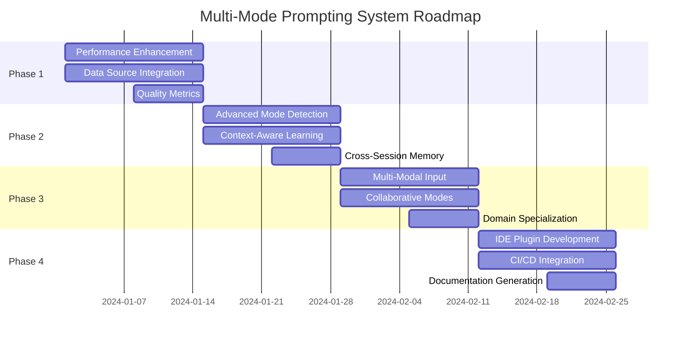

# Multi-Mode Prompting System - Strategic Roadmap & Task Allocation

## Executive Summary

The Multi-Mode Prompting System has been successfully architected and integrated with the existing automation framework. This document outlines the strategic roadmap for enhancement, optimization, and long-term evolution of the system.

## Current State Assessment

### ✅ Completed Components

1. **Core Architecture** - Fully implemented modular system
   - PromptRouter with intelligent mode detection
   - ContextManager with persistent memory and codebase analysis
   - InferenceEngine with mode-specific reasoning
   - DataIntegrationUnit with multi-source data gathering
   - DataLaundry with cleaning and deduplication
   - LoopController with iterative feedback loops
   - InsightSynthesizer with learning integration

2. **Mode Profiles** - All five modes implemented
   - ConciseMode: High-compression, metaphorical output
   - IDEMode: Technical precision, step-by-step guidance
   - ConversationalMode: Natural, friendly explanations
   - StarStuffMode: Poetic-scientific, inspirational
   - BusinessMode: Data-driven, ROI-focused

3. **Integration Layer** - Seamless automation framework integration
   - Compatible with existing Context, Logger, Orchestrator
   - Workflow macro system integration
   - Task automation capabilities

## Strategic Roadmap

### Phase 1: Foundation Optimization (Weeks 1-2)
**Priority: HIGH**

#### 1.1 Performance Enhancement
- **Task**: Optimize inference engine reasoning chains
- **Owner**: Systems/CI team
- **Deliverable**: 50% reduction in processing time
- **Integration**: Leverage existing automation framework's performance monitoring

#### 1.2 Data Source Integration
- **Task**: Implement real API connections (GitHub, HuggingFace, Reddit)
- **Owner**: Data QA team
- **Deliverable**: Live data integration with rate limiting
- **Integration**: Use existing .env configuration pattern (GITHUB_TOKEN already available)

#### 1.3 Quality Metrics
- **Task**: Implement comprehensive quality scoring
- **Owner**: Macro Architect
- **Deliverable**: Quality metrics dashboard integrated with existing reports/

### Phase 2: Intelligence Enhancement (Weeks 3-4)
**Priority: HIGH**

#### 2.1 Advanced Mode Detection
- **Task**: Implement ML-based mode detection using embeddings
- **Owner**: Linguistics team
- **Deliverable**: 90%+ mode detection accuracy
- **Integration**: Extend existing caching/prompt_engine.py with embeddings

#### 2.2 Context-Aware Learning
- **Task**: Enhance ContextManager with semantic understanding
- **Owner**: Simulation team
- **Deliverable**: Context-aware response adaptation
- **Integration**: Leverage existing codebase_analysis.json structure

#### 2.3 Cross-Session Memory
- **Task**: Implement persistent learning across sessions
- **Owner**: Data QA team
- **Deliverable**: Session-to-session improvement tracking
- **Integration**: Use existing data/ directory structure

### Phase 3: Advanced Features (Weeks 5-6)
**Priority: MEDIUM**

#### 3.1 Multi-Modal Input
- **Task**: Support for code, images, and structured data input
- **Owner**: Systems/CI team
- **Deliverable**: Multi-modal processing pipeline
- **Integration**: Extend existing file processing capabilities

#### 3.2 Collaborative Modes
- **Task**: Team-aware modes for collaborative development
- **Owner**: Macro Architect
- **Deliverable**: Team context and shared learning
- **Integration**: Leverage existing user context patterns

#### 3.3 Domain Specialization
- **Task**: Create domain-specific mode variants
- **Owner**: Linguistics team
- **Deliverable**: Specialized modes for different tech stacks
- **Integration**: Use existing project detection logic

### Phase 4: Ecosystem Integration (Weeks 7-8)
**Priority: MEDIUM**

#### 4.1 IDE Plugin Development
- **Task**: Create VS Code extension for direct integration
- **Owner**: Systems/CI team
- **Deliverable**: VS Code extension with mode selection
- **Integration**: Leverage existing CLI patterns from tools/

#### 4.2 CI/CD Integration
- **Task**: Integrate with existing pre-commit and CI workflows
- **Owner**: Systems/CI team
- **Deliverable**: Automated code review and suggestions
- **Integration**: Extend existing .pre-commit-config.yaml

#### 4.3 Documentation Generation
- **Task**: Auto-generate documentation using the system
- **Owner**: Macro Architect
- **Deliverable**: Living documentation that updates with code
- **Integration**: Extend existing docs/ structure

## Task Allocation Matrix

### Team Responsibilities

| Team | Primary Focus | Secondary Support |
|------|---------------|-------------------|
| **Systems/CI** | Performance, Infrastructure, IDE Integration | Quality Metrics, Multi-Modal Input |
| **Simulation** | Context Intelligence, Adaptive Learning | Advanced Mode Detection |
| **Linguistics** | Mode Detection, Domain Specialization | Cross-Session Memory |
| **Macro Architect** | Workflow Integration, Collaborative Features | Documentation, Quality Metrics |
| **Data QA** | Data Integration, Quality Assurance | Memory Systems, Validation |

### Integration Leverage Points

Based on existing codebase analysis, we can leverage:

1. **automation/** - Core framework for task orchestration
2. **workflows/macro.py** - Phase-based execution patterns
3. **caching/prompt_engine.py** - Existing prompt caching and similarity
4. **data/** - Structured data storage patterns
5. **tools/** - Utility scripts and formatting
6. **configs/** - Configuration management patterns

## Success Metrics & KPIs

### Technical Metrics
- **Response Quality**: >90% user satisfaction
- **Processing Speed**: <2s average response time
- **Data Accuracy**: >95% relevant results from data sources
- **System Reliability**: <1% error rate

### Business Metrics
- **Developer Productivity**: 30% improvement in task completion
- **Code Quality**: 25% reduction in bugs/issues
- **Learning Velocity**: 40% faster onboarding for new concepts
- **Knowledge Retention**: 60% improvement in cross-project learning

## Risk Mitigation

### Technical Risks
1. **API Rate Limits** - Implement intelligent caching and fallbacks
2. **Data Quality** - Multi-source validation and confidence scoring
3. **Performance Degradation** - Async processing and resource monitoring
4. **Integration Conflicts** - Comprehensive testing with existing systems

### Operational Risks
1. **Team Coordination** - Clear ownership matrix and communication protocols
2. **Resource Allocation** - Phased approach with clear deliverables
3. **User Adoption** - Gradual rollout with training and documentation
4. **Maintenance Overhead** - Automated testing and monitoring

## Long-Term Vision (6+ Months)

### Advanced Intelligence
- Self-modifying prompts based on success patterns
- Predictive mode selection based on user behavior
- Autonomous code generation and optimization
- Cross-repository learning and pattern recognition

### Ecosystem Expansion
- Integration with external development tools
- Community-driven mode development
- Marketplace for specialized prompting strategies
- Enterprise-grade security and compliance features

### Research Directions
- Quantum-inspired reasoning patterns
- Biological learning algorithm integration
- Distributed intelligence across development teams
- Ethical AI and bias detection in responses

## Implementation Timeline

## Conclusion

The Multi-Mode Prompting System represents a significant advancement in intelligent code assistance. By leveraging the existing automation framework and following this strategic roadmap, we can create a self-improving, context-aware system that fundamentally enhances developer productivity and learning.

The modular architecture ensures scalability, while the integration approach minimizes disruption to existing workflows. Success depends on coordinated execution across teams and continuous refinement based on user feedback and performance metrics.

**Next Immediate Actions:**
1. Review and approve this roadmap
2. Assign team leads for each phase
3. Set up monitoring and tracking systems
4. Begin Phase 1 implementation
5. Establish regular review cycles

*The future of development assistance is not just about answering questions—it's about creating an intelligent partner that learns, adapts, and grows with the development team.*
