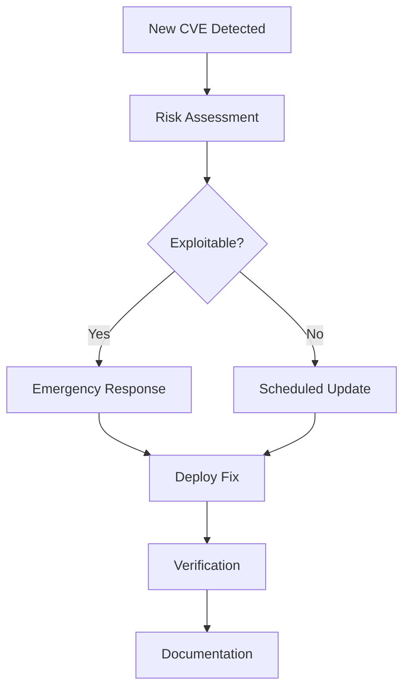

# Security Best Practices Guide

## Docker Security Fundamentals

### 1. Image Security

#### Base Image Selection
```dockerfile
# ❌ Avoid: Latest tags without verification
FROM ubuntu:latest

# ✅ Use: Specific, verified base images
FROM ubuntu:22.04@sha256:abcd1234...

# ✅ Use: Minimal base images
FROM alpine:3.18
```

#### Package Management
```dockerfile
# ❌ Don't install unnecessary packages
RUN apt-get update && apt-get install -y wget curl vim nano

# ✅ Install only required packages
RUN apt-get update && apt-get install -y --no-install-recommends \
    curl \
    && rm -rf /var/lib/apt/lists/*
```

### 2. Container Runtime Security

#### User Management
```dockerfile
# ❌ Don't run as root
USER root

# ✅ Create and use non-root user
RUN groupadd -r appuser && useradd -r -g appuser appuser
USER appuser
```

#### Resource Limits
```yaml
# docker-compose.yml
services:
  web:
    deploy:
      resources:
        limits:
          cpus: '0.50'
          memory: 512M
        reservations:
          cpus: '0.25'
          memory: 256M
```

### 3. Network Security

#### Port Exposure
```dockerfile
# ❌ Expose unnecessary ports
EXPOSE 22 80 443 3306

# ✅ Expose only required ports
EXPOSE 8080
```

#### Network Policies
```yaml
# Network segmentation
networks:
  frontend:
    driver: bridge
  backend:
    driver: bridge
    internal: true
```

## Vulnerability Management

### Scanning Strategy

#### Regular Scanning Schedule
```bash
# Weekly vulnerability scans
0 2 * * 0 /path/to/docker-security-automation-enhanced.sh 4

# Monthly comprehensive reports
0 3 1 * * /path/to/generate-security-dashboard.sh
```

#### Critical Vulnerability Response
1. **Immediate Assessment** (0-4 hours)
   - Evaluate exploitability
   - Assess business impact
   - Identify affected systems

2. **Containment** (4-24 hours)
   - Isolate affected containers
   - Block malicious traffic
   - Notify stakeholders

3. **Remediation** (24-72 hours)
   - Update base images
   - Rebuild containers
   - Deploy fixes

4. **Verification** (72+ hours)
   - Validate fixes
   - Update documentation
   - Monitor for recurrence

### Patch Management

#### Update Process


## Compliance Requirements

### CIS Docker Benchmark

#### Essential Controls
- **2.1**: Do not use deprecated execution drivers
- **4.1**: Create a user for the container
- **5.1**: Ensure privileged containers are not used
- **5.7**: Ensure memory usage is limited
- **5.9**: Ensure root filesystem is read-only

#### Implementation Examples
```bash
# Check compliance status
./docker-security-automation-enhanced.sh 15

# Generate compliance report
./generate-security-dashboard.sh
```

### GDPR Compliance

#### Data Protection Measures
- Encrypt data at rest and in transit
- Implement proper access controls
- Maintain audit logs for 7 years
- Regular security assessments

### HIPAA Compliance

#### Healthcare Data Protection
- Implement BAA agreements
- Encrypt PHI data
- Access logging and monitoring
- Regular security risk assessments

## Incident Response

### Security Incident Procedure

#### 1. Detection and Assessment
- Monitor security logs continuously
- Alert on critical vulnerabilities
- Assess potential impact

#### 2. Containment
- Isolate affected containers
- Stop malicious processes
- Preserve evidence

#### 3. Eradication
- Remove malicious code
- Update affected images
- Patch vulnerabilities

#### 4. Recovery
- Restore from clean backups
- Monitor for re-infection
- Validate system integrity

### Communication Plan

#### Internal Communication
- **Security Team**: Immediate notification
- **Management**: Status updates every 4 hours
- **IT Team**: Technical coordination
- **Users**: Service impact notifications

#### External Communication
- **Customers**: Service disruption notices
- **Regulators**: Breach notifications within 72 hours
- **Public**: Statement only if required

## Monitoring and Alerting

### Key Metrics to Monitor

#### Security Metrics
- Number of critical vulnerabilities
- Mean time to remediation (MTTR)
- Container privilege escalation attempts
- Failed authentication attempts

#### Operational Metrics
- Container uptime and availability
- Resource utilization trends
- Backup success rates
- Scan completion times

### Alert Thresholds

#### Critical Alerts
- **CVE Score ≥ 9.0**: Immediate notification
- **Privileged container detected**: Block and alert
- **Root user in production**: Emergency response

#### Warning Alerts
- **CVE Score 7.0-8.9**: Next business day response
- **Unusual network traffic**: Investigation required
- **Resource exhaustion**: Performance review

## Advanced Security Features

### Secrets Management

#### Best Practices
```bash
# Generate strong secrets
openssl rand -base64 32 > secrets/db_password.txt

# Set restrictive permissions
chmod 600 secrets/*

# Use secrets in containers
docker run --secret db_password secrets/db_password.txt
```

### Content Trust

#### Implementation
```bash
# Enable Content Trust
export DOCKER_CONTENT_TRUST=1

# Verify image signatures
docker trust inspect image:tag

# Sign your own images
docker trust sign image:tag
```

### Security Scanning Integration

#### CI/CD Pipeline Integration
```yaml
# GitHub Actions example
name: Security Scan
on: [push, pull_request]

jobs:
  security:
    runs-on: ubuntu-latest
    steps:
      - uses: actions/checkout@v3
      - name: Run Security Scan
        run: ./docker-security-automation-enhanced.sh 4
      - name: Upload Results
        uses: actions/upload-artifact@v3
        with:
          name: security-report
          path: logs/
```

## Troubleshooting

### Common Issues

#### Docker Daemon Issues
```bash
# Check daemon status
sudo systemctl status docker

# View daemon logs
sudo journalctl -u docker.service

# Reset daemon configuration
sudo ./docker-security-automation-enhanced.sh 2
```

#### Scanning Problems
```bash
# Check Docker Scout status
docker scan --help

# Verify image access
docker pull image:tag

# Check network connectivity
curl -I https://index.docker.io
```

#### Permission Issues
```bash
# Fix Docker socket permissions
sudo chmod 660 /var/run/docker.sock

# Add user to docker group
sudo usermod -aG docker $USER

# Reload group membership
newgrp docker
```

### Performance Optimization

#### Scanning Performance
- Scan during off-peak hours
- Use incremental scanning for large registries
- Implement scan result caching
- Parallel scanning for multiple images

#### Storage Optimization
- Regular cleanup of unused images
- Compressed backup archives
- Log rotation and archiving
- Temporary file cleanup

## Security Checklist

### Pre-Deployment
- [ ] Vulnerability scan completed
- [ ] Secrets properly configured
- [ ] Non-root user configured
- [ ] Resource limits set
- [ ] Health checks implemented

### Production Deployment
- [ ] Content Trust enabled
- [ ] Network policies applied
- [ ] Monitoring configured
- [ ] Backup strategy tested
- [ ] Compliance validated

### Ongoing Operations
- [ ] Weekly vulnerability scans
- [ ] Monthly compliance reviews
- [ ] Quarterly security assessments
- [ ] Annual penetration testing
- [ ] Continuous monitoring active

---

*This guide is part of the Docker Security Automation Suite documentation.*
*Last updated: $(date)*
