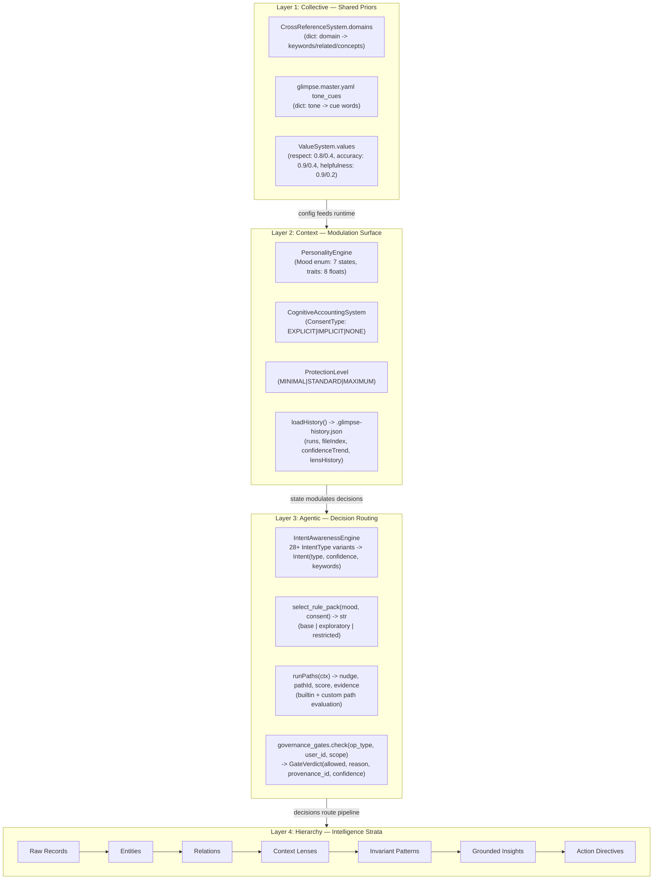
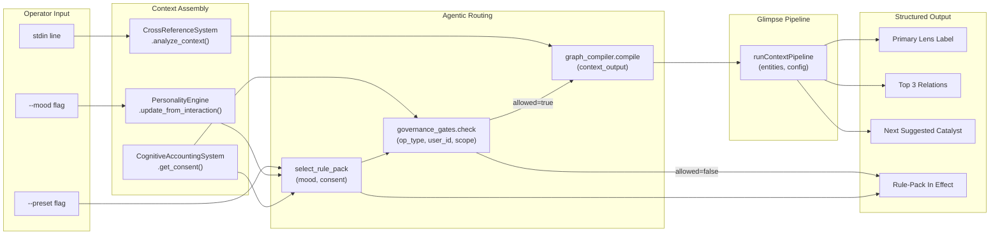

# Atlas Schema: Hierarchical Knowledge-Graph Workflow

Reference model: Jung's collective unconscious as architectural metaphor.
Implementation anchor: Echoes-first, Glimpse as graph interface.

## Four-Layer Architecture

## Layer 1: Collective (Shared Priors)

Jung analogue: archetypal images accessible without personal experience.

### Type Bindings

| Component | Echoes Type | Location | Shape |
|-----------|-------------|----------|-------|
| Domain taxonomy | `CrossReferenceSystem.domains` | `core_modules/cross_reference_system.py` | `dict[str, {keywords: list[str], related: list[str], concepts: list[str]}]` |
| Value priors | `ValueSystem.values` | `app/values.py` | `dict[str, ValueScore(name: str, score: float, weight: float)]` |
| Tone cue lexicon | `glimpse.master.yaml` `semantic_packs.tone_cues` | `CascadeProjects/Applications/glimpse-engine/glimpse.master.yaml` | `dict[str, list[str]]` (tone_name -> cue_words) |
| Preset weights | `glimpse.master.yaml` `presets` | same | `dict[str, {lens_weights: dict, view_bias: dict}]` |

### Contract

- Read-only during a single session.
- Mutations require explicit config update with provenance record (`_emit_provenance`).
- No runtime code may add/remove domains, values, or tone cues within a session boundary.

## Layer 2: Context (Modulation Surface)

Jung analogue: complex as a cluster of associations that colors perception.

### Type Bindings

| Component | Echoes Type | Location | Shape |
|-----------|-------------|----------|-------|
| Mood state | `Mood` enum | `core_modules/personality_engine.py` | One of: `ENTHUSIASTIC`, `CURIOUS`, `SUPPORTIVE`, `PLAYFUL`, `FOCUSED`, `CALM`, `CREATIVE` |
| Personality traits | `PersonalityTrait` enum + `traits` dict | same | `dict[PersonalityTrait, float]` (8 traits, each 0.0-1.0) |
| Consent type | `ConsentType` enum | `legal_safeguards.py` | One of: `EXPLICIT`, `IMPLICIT`, `NONE` |
| Protection level | `ProtectionLevel` enum | `legal_safeguards.py` | One of: `MINIMAL`, `STANDARD`, `MAXIMUM` |
| Provenance chain | `CognitiveAccountingSystem.provenance_chain` | `legal_safeguards.py` | `list[dict]` with `decision_type`, `action_taken`, `actor_id`, `reasoning`, `authority`, `timestamp`, `hash` |
| Session history | `loadHistory()` return | `glimpse-engine/core/learning.js` | `{runs, fileIndex, patternIndex, confidenceTrend, lensHistory, thresholds}` |

### Contract

- Mutable per-session.
- Every `ConsentType` change emits a provenance record via `_emit_provenance()`.
- Consent gates (`can_process`) must be evaluated before any state transition that touches personal-scope data.
- Mood transitions must append to `mood_history` with timestamp and trigger.

## Layer 3: Agentic (Decision Routing)

Jung analogue: ego as mediator selecting which complex to act on.

### Type Bindings

| Component | Echoes Type | Location | Input | Output |
|-----------|-------------|----------|-------|--------|
| Intent detection | `IntentAwarenessEngine.detect_intent()` | `core_modules/intent_awareness_engine.py` | `str` (user text) | `Intent(type: IntentType, confidence: float, keywords: list, context: str, parameters: dict)` |
| Rule-pack selection | `select_rule_pack()` (new) | `core_modules/personality_engine.py` | `Mood`, `ConsentType` | `str` in `{"base", "exploratory", "restricted"}` |
| Path evaluation | `runPaths()` | `glimpse-engine/core/paths.js` | `PathContext` | `{nudge: str, pathId: str, score: float, evidence: list, all: list}` |
| Governance gate | `governance_gates.check()` (new) | `core_modules/governance_gates.py` | `str op_type, str user_id, str scope` | `GateVerdict(allowed: bool, reason: str, provenance_id: str, confidence: float)` |
| Interview modulation | `applyInterviewModulation()` | `glimpse-engine/core/interview.js` | `pathResult`, `interviewResult` | modified `pathResult` with modulation suffix |

### Contract

- Every decision must emit evidence/trace (provenance record or rule trace).
- Consent gate (`governance_gates.check()`) must be evaluated before surfacing personal-scope data.
- If any component fails, degrade gracefully: return null nudge / empty evidence, never crash.
- Rule-pack selection truth table:

| Consent \ Mood | CREATIVE / CURIOUS | All other moods |
|----------------|-------------------|-----------------|
| EXPLICIT | `exploratory` | `base` |
| IMPLICIT | `base` | `base` |
| NONE | `restricted` | `restricted` |

## Layer 4: Hierarchy (Intelligence Strata)

Jung analogue: individuation as progressive integration of unconscious material into conscious understanding.

### Strata (each stratum's output is the next stratum's input)

| Stratum | Input Type | Output Type | Implementation |
|---------|-----------|-------------|----------------|
| S0: Ingest | raw text / JSON records | normalized records | `parseCSV()` / `normalizeRecords()` (Glimpse) or `analyze_context()` (Echoes) |
| S1: Profile | normalized records | `DataProfile` with flags, dimensions, descriptors | `buildDataProfile()` (Glimpse) |
| S2: Entity | records + profile | `Entity[]` with id, name, type, dimensions, domainKeywordHits, tones | `buildEntities()` (Glimpse) or `graph_compiler.compile()` (new, Echoes) |
| S3: Relate | entities | `Relation[]` with source, target, type, weight, similarity | `buildBaseRelations()` (Glimpse) |
| S4: Score | entities + relations + rules | `contextLenses[]`, `viewPreferences`, `entityLensScores` | `applyRules()` + `summarizeLenses()` (Glimpse) |
| S5: Pattern | scored evidence | `invariantPatterns[]` with densityScore, firingCount | `findInvariantPatterns()` + `rankByDensity()` (Glimpse) |
| S6: Ground | patterns + dataset | `groundedInsights[]` with confidence, basis | `applyGrounding()` (Glimpse) |
| S7: Direct | grounded insights + governance verdict | action directives (structured output for operator) | New: `atlas_repl.py` output formatter |

### Contract

- No stratum may skip its predecessor.
- Confidence is non-increasing: downstream stratum cannot claim higher confidence than the upstream evidence that produced it.
- Each stratum logs its input count and output count to the trace (for drift monitoring).

## Governance Invariants (Cross-Layer)

1. **Fail-closed default:** if consent state is unknown or `NONE`, the system operates in `restricted` mode.
2. **Provenance completeness:** every consent change, governance gate evaluation, and rule-pack selection produces a provenance record.
3. **Non-escalation:** no stratum, agent, or path may elevate confidence beyond the maximum confidence of its input evidence.
4. **Bounded creativity:** exploratory paths (simulations, analogies, humor) require `EXPLICIT` consent + mood in `{CREATIVE, CURIOUS}` to enter `exploratory` rule-pack.
5. **Trace lineage:** every action directive at S7 must reference the governance gate verdict that authorized it, and the evidence chain back to S0.

## Agentic Workflow Diagram

