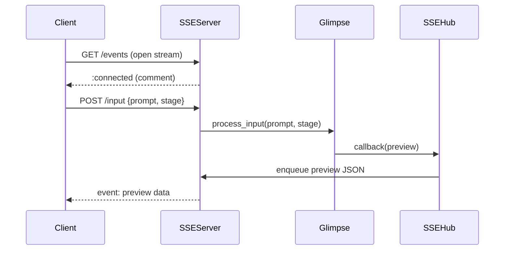
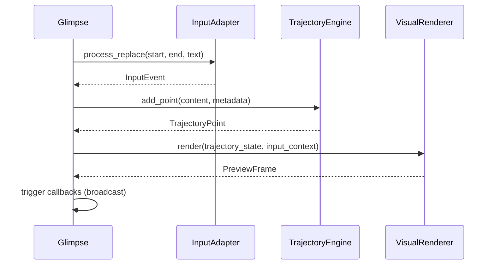

# Glimpse Realtime System — Integration Overview

This document explains how major components interact and how realtime previews flow from user input to the browser.

## Key Components
- **Client (Browser / CLI)** — Sends prompt updates and listens for preview frames.
- **`server_sse.py`** (SSE Server)
  - HTTP endpoints:
    - `POST /input` — submit prompt updates.
    - `GET  /events` — Server-Sent Events stream.
    - `GET  /health` — readiness probe.
  - Embeds an instance of `GlimpseOrchestrator` and an `SSEHub` for broadcasting.
- **`realtime_preview.py` → `GlimpseOrchestrator`** — Core engine combining:
  - `InputAdapter` (edit tracking & suggestions)
  - `TrajectoryEngine` (behavior modelling)
  - `VisualRenderer` (ASCII + animation frames)
  - `SecurityManager` (optional)
- **`SSEHub`** — Thread-safe fan-out queue for multiple clients.

---

## External Preview Workflow

---

## Internal Processing Workflow

---

## File Responsibilities
- `server_sse.py` — networking layer, SSE stream & REST input endpoint.
- `realtime_preview.py` — orchestration and component wiring.
- `input_adapter.py` — low-level edit tracking & suggestion context.
- `core_trajectory.py` — behavioural analytics & prediction.
- `visual_renderer.py` — converts state into frames / ASCII previews.
- `security_integration.py` — runtime guardrails.

---

## Component Internals

### Security Integration (`security_integration.py`)
- Dynamically loads a parent `thon.py` module for advanced security (if available).
- Provides `SecurityManager` for context/risk assessment, operation validation, and defensive command checks.
- Exposes shield factor, risk level, and allowed operations per session; can export detailed security reports.

### Visual Renderer (`visual_renderer.py`)
- `VisualRenderer` generates real-time previews as frames, supporting multiple visualization modes (timeline, tree, flow, heatmap).
- Renders trajectory points, cause-effect chains, and activity heatmaps as both ASCII and (optionally) image previews.
- Color schemes and glyph palettes support rich terminal and graphical output.

### Trajectory Engine (`core_trajectory.py`)
- `TrajectoryEngine` tracks a rolling window of input/content states as `TrajectoryPoint`s.
- Analyzes direction (expanding, converging, pivoting, stable, uncertain) and computes confidence/health metrics.
- Segments trajectory into coherent phases and predicts likely next states; can export full history as JSON.

---

## Future Enhancements
- WebSocket upgrade option for richer duplex messaging.
- Integrate auth middleware in `server_sse.py`.
- Persist trajectory snapshots to database (currently JSON on disk).
- Expand `VisualRenderer` to support SVG or Canvas rendering.
