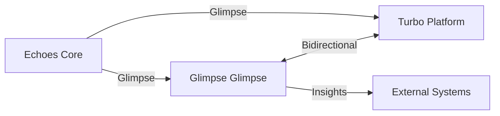

# Glimpse Architecture

## Overview
Glimpse is the unified framework for cross-platform awareness and bridging within the Echoes ecosystem. It serves as the core intelligence layer that enables seamless integration between different system components and external platforms.

## Core Components

### 1. Glimpse Bridge
**Purpose**: Central hub for cross-platform communication and data flow

**Key Features**:
- Unified interface for all platform interactions
- Protocol-agnostic communication layer
- Real-time data synchronization
- Automatic failover and recovery

**Implementation**:
```python
class SmartVisionBridge:
    def __init__(self, config: BridgeConfig):
        self.connectors = {
            'glimpse': GlimpseConnector(),
            'turbo': TurboConnector(),
            'echoes': EchoesConnector()
        }
    
    async def observe(self, source: str, data: Any) -> Observation:
        """Process and route observations from any source"""
        connector = self.connectors.get(source)
        if connector:
            return await connector.process_observation(data)
        raise ValueError(f"Unsupported source: {source}")
```

### 2. Glimpse Core
**Purpose**: Advanced pattern recognition and insight generation

**Key Features**:
- Real-time trajectory analysis
- Anomaly detection
- Predictive modeling
- Context-aware recommendations

**Implementation**:
```python
class GlimpseEngine:
    def analyze_trajectory(self, data: TrajectoryData) -> AnalysisResult:
        """Analyze system/behavior trajectories"""
        # Advanced pattern recognition and analysis
        pass
    
    def generate_insights(self, context: Context) -> List[Insight]:
        """Generate actionable insights from current state"""
        # Context-aware insight generation
        pass
```

## Integration Points

### 1. Echoes Core Integration
```python
# In assistant_v2_core.py
class EchoesAssistantV2:
    def __init__(self, vision_bridge: SmartVisionBridge):
        self.vision = vision_bridge
        self.glimpse = GlimpseEngine()
    
    async def process_request(self, request: UserRequest):
        # Use Glimpse for enhanced context awareness
        context = await self.vision.observe('echoes', request)
        insights = self.glimpse.generate_insights(context)
        return await self.formulate_response(insights)
```

### 2. Cross-Platform Communication


## Implementation Roadmap

### Phase 1: Foundation (Current)
- [x] Core Glimpse Bridge implementation
- [x] Basic Glimpse Glimpse integration
- [x] Cross-platform communication protocols

### Phase 2: Enhanced Vision (Q1 2026)
- [ ] Advanced pattern recognition
- [ ] Predictive analytics
- [ ] Self-optimizing routing

### Phase 3: Unified Intelligence (Q2 2026)
- [ ] Federated learning across platforms
- [ ] Autonomous decision making
- [ ] Cognitive architecture integration

## Usage Examples

### Basic Observation
```python
# Initialize the bridge
bridge = SmartVisionBridge(config=bridge_config)

# Send observation
observation = await bridge.observe(
    source='echoes',
    data={
        'event': 'user_interaction',
        'data': {...}
    }
)
```

### Advanced Analysis
```python
# Get insights from Glimpse
analysis = glimpse_engine.analyze_trajectory(trajectory_data)
insights = glimpse_engine.generate_insights(analysis)

# Route insights through Glimpse
for insight in insights:
    await bridge.observe('glimpse', insight.to_dict())
```

## Best Practices

1. **Consistent Naming**:
   - Use `Glimpse` prefix for all core components
   - `Glimpse` for analysis-specific functionality
   - `Bridge` for communication components

2. **Error Handling**:
   - Implement graceful degradation
   - Maintain audit trails
   - Provide meaningful error messages

3. **Performance**:
   - Use async/await for I/O operations
   - Implement caching where appropriate
   - Monitor and optimize hot paths

## Dependencies
- Python 3.8+
- AsyncIO for concurrent operations
- Protocol Buffers for efficient serialization
- Redis for caching and pub/sub

## Security Considerations
- All cross-platform communication must be encrypted
- Implement strict authentication/authorization
- Regular security audits
- Data minimization principles

## Monitoring and Metrics
- Track bridge message throughput
- Monitor Glimpse analysis latency
- Alert on abnormal patterns
- Log all critical operations

## Troubleshooting

### Common Issues
1. **Connection Drops**:
   - Verify network connectivity
   - Check authentication tokens
   - Review rate limits

2. **Performance Degradation**:
   - Monitor system resources
   - Check for memory leaks
   - Review query patterns

3. **Data Inconsistencies**:
   - Verify data schemas
   - Check for version mismatches
   - Validate transformation logic
