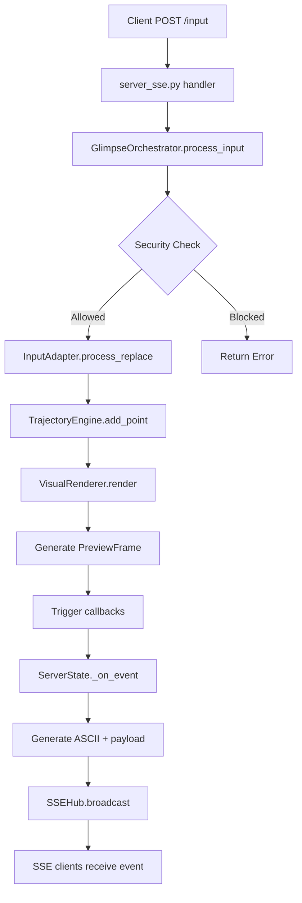

# Instruction Processing Pipeline — Glimpse Realtime

## Overview
This document details how user instructions flow through the Glimpse system from initial HTTP request to final preview broadcast.

---

## Pipeline Stages

### 1. Input Reception (`server_sse.py`)
**Endpoint:** `POST /input`  
**Payload:**
```json
{
  "prompt": "user text content",
  "stage": "draft" | "final"
}
```

**Handler:** `PreviewRequestHandler._handle_input()`
- Validates JSON body
- Extracts `prompt` and `stage` (defaults to "draft")
- Updates `ServerState.current_stage`
- Delegates to orchestrator

---

### 2. Orchestration (`realtime_preview.py`)
**Method:** `GlimpseOrchestrator.process_input(action, **kwargs)`

**Supported Actions:**
- `insert` — add text at position
- `delete` — remove range
- `replace` — substitute range (used by SSE server for full prompt updates)
- `undo` / `redo` — history navigation

**Flow:**
1. **Security Check** (if enabled)
   - Validates operation via `SecurityManager.validate_operation("track")`
   - Returns error if shield factor too low
2. **Input Processing**
   - Calls appropriate `InputAdapter` method
   - Receives `InputEvent` with delta and metadata
3. **Trajectory Update**
   - `TrajectoryEngine.add_point()` with content and metadata
   - Returns `TrajectoryPoint` with direction, confidence, cause-effect chain
4. **Preview Generation**
   - `VisualRenderer.render()` creates `PreviewFrame`
   - Includes visual elements for timeline/tree/flow/heatmap
5. **Adaptation & Prediction** (optional)
   - `InputAdapter.get_adaptation_context()` for suggestions
   - `TrajectoryEngine.predict_next_states()` for trajectory forecasts
6. **Event Callback**
   - Triggers registered callbacks with event data
   - SSE server's `_on_event()` receives preview frame

---

### 3. Input Adaptation (`input_adapter.py`)

**Core Methods:**
- `process_insert(position, text)` → `InputEvent`
- `process_delete(start, end)` → `InputEvent`
- `process_replace(start, end, text)` → `InputEvent`

**Responsibilities:**
- Maintains `current_content` state
- Manages undo/redo stacks
- Computes typing velocity and edit intensity
- Generates adaptation context with suggestions

**Key Metrics:**
- **Typing Velocity** — chars/sec over last 10 events
- **Edit Intensity** — edits/sec over last 20 events
- **Adaptation Confidence** — based on event consistency (insert-heavy vs. mixed)

---

### 4. Trajectory Analysis (`core_trajectory.py`)

**Method:** `TrajectoryEngine.add_point(content, metadata)`

**Analysis Steps:**
1. **Direction Analysis** — computes `TrajectoryDirection`:
   - `EXPANDING` — content growing
   - `CONVERGING` — content shrinking
   - `PIVOTING` — high variance
   - `STABLE` — steady state
   - `UNCERTAIN` — insufficient data
2. **Confidence Computation** — based on recent direction consistency
3. **Cause-Effect Tracing** — builds chain from last 3 points
4. **Segment Update** — creates new segment when dominant direction changes

**Output:** `TrajectoryPoint` with timestamp, direction, confidence, cause-effect chain

---

### 5. Visual Rendering (`visual_renderer.py`)

**Method:** `VisualRenderer.render(trajectory_state, input_context)`

**Visualization Modes:**
- **Timeline** — linear sequence with cause-effect chains
- **Tree** — segment branches with dominant directions
- **Flow** — momentum particles and direction indicators
- **Heatmap** — edit intensity grid

**Frame Generation:**
1. Extract recent trajectory points and input activity
2. Create `VisualElement` objects (nodes, edges, particles)
3. Apply color schemes based on direction
4. Build `PreviewFrame` with metadata
5. Store frame in history

**ASCII Preview:**
- `generate_ascii_preview(frame, blur)` produces terminal-friendly output
- Optional ANSI color codes for rich display
- Blur parameter controls draft vs. final fidelity

---

### 6. Broadcast (`server_sse.py`)

**Callback:** `ServerState._on_event(event)`

**Steps:**
1. Extract `preview` frame from event
2. Determine blur based on stage (draft=0.7, final=0.1)
3. Generate ASCII preview
4. Construct broadcast payload:
   ```json
   {
     "type": "preview",
     "stage": "draft|final",
     "job_id": 123,
     "frame": {...},
     "ascii": "...",
     "ts": 1634567890.123
   }
   ```
5. `SSEHub.broadcast()` pushes to all connected client queues
6. Each `/events` client receives SSE message:
   ```
   event: preview
   data: {...JSON payload...}
   ```

---

## Complete Flow Diagram



---

## Key Configuration Points

### Security Thresholds
- **Shield Factor ≥ 0.3** — required to track
- **Shield Factor ≥ 0.5** — required to suggest/adapt
- **Shield Factor ≥ 0.7** — required to export/save

### Performance Parameters
- `window_size=100` — trajectory rolling window
- `buffer_size=50` — input event history
- `auto_save_interval=60.0` — seconds between autosaves

### Visualization
- `blur=0.7` for draft stage (high blur)
- `blur=0.1` for final stage (low blur)
- Color schemes per direction (expanding=green, converging=blue, etc.)

---

## Extension Points

### Custom Analyzers
Register trajectory direction analyzers:
```python
def custom_analyzer(points: List[TrajectoryPoint]) -> TrajectoryDirection:
    # Your logic here
    return TrajectoryDirection.EXPANDING

engine.register_analyzer(custom_analyzer)
```

### Custom Suggestions
Register input suggestion providers:
```python
def custom_provider(context: AdaptationContext) -> List[str]:
    return ["suggestion1", "suggestion2"]

adapter.register_suggestion_provider(custom_provider)
```

### Event Callbacks
Listen to all processing events:
```python
def my_callback(event_data: Dict[str, Any]):
    preview = event_data.get("preview")
    # Process preview

orchestrator.register_event_callback(my_callback)
```

---

## Debugging Tips

1. **Enable detailed logging:**
   ```python
   import logging
   logging.getLogger("glimpse").setLevel(logging.DEBUG)
   ```

2. **Check security context:**
   ```python
   metrics = orchestrator.security.get_security_metrics()
   print(metrics["context"]["shield_factor"])
   ```

3. **Inspect trajectory state:**
   ```python
   state = orchestrator.trajectory.get_current_state()
   print(state["current_direction"], state["confidence"])
   ```

4. **Monitor SSE broadcast:**
   - Check `application.log` for server activity
   - Use browser DevTools → Network → EventStream to see live events

---

## Performance Considerations

- **Input throttling:** Server processes every POST; consider client-side debouncing for rapid typing
- **Frame buffer:** Renderer keeps all frames; use `clear_frames()` or `export_animation(frame_limit=N)` for memory management
- **Security overhead:** Disable with `enable_security=False` if performance-critical and trusted environment
- **ASCII generation:** Relatively fast, but blur calculation adds overhead—cache when possible
